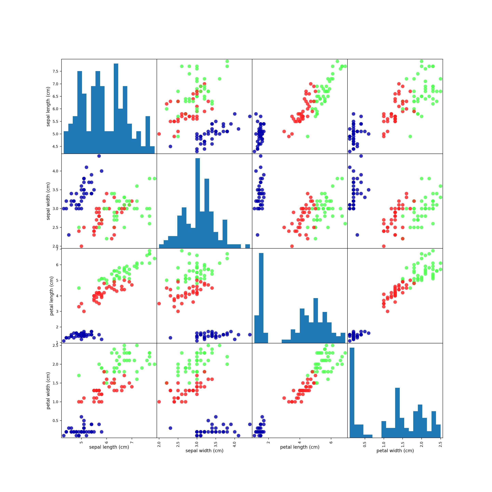

# はじめに


真の前置き的なやつ。

## なぜ機械学習なのか

- if〜then〜のエキスパートシステムには限界がある。
    - ロジックがドメイン固有のものになり、タスクが変化したら作り直さないといけない。
    - 人間のエキスパートの思考に対する深い理解が必要。
    - 顔認識とかはちょっと無理。
    
### 機械学習で解決可能な問題

世の中には教師のある学習と教師のない学習がある。

- **教師あり学習**
    - 入力と出力のペアを与えてアルゴリズムを学習させる。
    - 未知の入力に対する出力を予測する。
    - データセットを集めることが大変な場合もある。
- **教師なし学習**
    - 出力のないデータセットでアルゴリズムを学習させる。
    - トピック解析やクラスタリング、異常検知など。

サンプルと特徴量。

- **サンプル**
     - 個々のエンティティまたは量。
- **特徴量**
    - エンティティの持つ特性を表現する列。
    
*情報量のないデータからは学習できない*ことを覚えておくこと。

### タスクを知り、データを知る

- よくデータを理解すること
    - そのデータでそもそも問題を解決できるのか？
    - どんな機械学習の問題に置き換えるべきか？
    - データの数は十分か？

アルゴリズムは問題の一部にすぎない。全体を心に留めておくこと。

## なぜPythonなのか？

- つよい
  - 汎用言語の強さとドメイン特価スクリプト言語の強さがある。
- Jupyter Notebookが使える
  - データ解析はインタラクティブな過程。
  
## scikit-learn

- Pythonで機械学習といったらこれ
- オープンソース
- ユーザーガイドも読んでおこうな
    - http://scikit-learn.org/stable/user_guide.html

### インストール

```bash
$ pip install numpy scipy matplotlib ipython scikit-learn pandas pillow
```

この他、章によってはgraphvizが必要な部分もある。

## 必要なライブラリとツール

- Jupyter Notebook
    - ブラウザ上でMarkdownとコード混ぜて書けるやつ。
- NumPy
    - 配列計算ﾒｯﾁｬﾊﾔｲやつ
- SciPy
    - 科学技術計算できるやつ
- matplotlib
    - プロットするやつ
- pandas
    - Rのデータフレーム的な感じでデータ扱えるやつ
- mglearn
    - 「こちらに予め調理したものがあります」的に教科書の例試せるやつ
  
## Python 2 vs. Python 3

3でやれ。

## 最初のアプリケーション: アイリスのクラス分類

- **みんな大好きiris**。
- 以下の記事が詳しい。
    - [irisの正体 (R Advent Calendar 2012 6日目) - どんな鳥も](http://d.hatena.ne.jp/tsutatsutatsuta/20121206/1354737461)

### データを読む

- `scikit-learn`の`datasets`モジュール
    - いろんなサンプルデータセットが入ってる。
    - `sklearn.datasets.load_iris()`で**iris**が返ってくるので適当に受けよう。


```python
from sklearn.datasets import load_iris
iris_dataset = load_iris()
```

`load_iris()`は**Bunch**クラスのオブジェクトを返す。これはディクショナリみたいに扱える。値には`iris_dataset['data']`以外に`iris_dataset.data`みたいにアクセスしてもいい。


```python
print(iris_dataset.keys())
 ## dict_keys(['target', 'feature_names', 'target_names', 'data', 'DESCR'])
```

キー**DESCR**の中にデータセットの説明が入っている。


```python
print(iris_dataset.DESCR)
 ## Iris Plants Database
 ## ====================
 ## 
 ## Notes
 ## -----
 ## Data Set Characteristics:
 ##     :Number of Instances: 150 (50 in each of three classes)
 ##     :Number of Attributes: 4 numeric, predictive attributes and the class
 ##     :Attribute Information:
 ##         - sepal length in cm
 ##         - sepal width in cm
 ##         - petal length in cm
 ##         - petal width in cm
 ##         - class:
 ##                 - Iris-Setosa
 ##                 - Iris-Versicolour
 ##                 - Iris-Virginica
 ##     :Summary Statistics:
 ## 
 ##     ============== ==== ==== ======= ===== ====================
 ##                     Min  Max   Mean    SD   Class Correlation
 ##     ============== ==== ==== ======= ===== ====================
 ##     sepal length:   4.3  7.9   5.84   0.83    0.7826
 ##     sepal width:    2.0  4.4   3.05   0.43   -0.4194
 ##     petal length:   1.0  6.9   3.76   1.76    0.9490  (high!)
 ##     petal width:    0.1  2.5   1.20  0.76     0.9565  (high!)
 ##     ============== ==== ==== ======= ===== ====================
 ## 
 ##     :Missing Attribute Values: None
 ##     :Class Distribution: 33.3% for each of 3 classes.
 ##     :Creator: R.A. Fisher
 ##     :Donor: Michael Marshall (MARSHALL%PLU@io.arc.nasa.gov)
 ##     :Date: July, 1988
 ## 
 ## This is a copy of UCI ML iris datasets.
 ## http://archive.ics.uci.edu/ml/datasets/Iris
 ## 
 ## The famous Iris database, first used by Sir R.A Fisher
 ## 
 ## This is perhaps the best known database to be found in the
 ## pattern recognition literature.  Fisher's paper is a classic in the field and
 ## is referenced frequently to this day.  (See Duda & Hart, for example.)  The
 ## data set contains 3 classes of 50 instances each, where each class refers to a
 ## type of iris plant.  One class is linearly separable from the other 2; the
 ## latter are NOT linearly separable from each other.
 ## 
 ## References
 ## ----------
 ##    - Fisher,R.A. "The use of multiple measurements in taxonomic problems"
 ##      Annual Eugenics, 7, Part II, 179-188 (1936); also in "Contributions to
 ##      Mathematical Statistics" (John Wiley, NY, 1950).
 ##    - Duda,R.O., & Hart,P.E. (1973) Pattern Classification and Scene Analysis.
 ##      (Q327.D83) John Wiley & Sons.  ISBN 0-471-22361-1.  See page 218.
 ##    - Dasarathy, B.V. (1980) "Nosing Around the Neighborhood: A New System
 ##      Structure and Classification Rule for Recognition in Partially Exposed
 ##      Environments".  IEEE Transactions on Pattern Analysis and Machine
 ##      Intelligence, Vol. PAMI-2, No. 1, 67-71.
 ##    - Gates, G.W. (1972) "The Reduced Nearest Neighbor Rule".  IEEE Transactions
 ##      on Information Theory, May 1972, 431-433.
 ##    - See also: 1988 MLC Proceedings, 54-64.  Cheeseman et al"s AUTOCLASS II
 ##      conceptual clustering system finds 3 classes in the data.
 ##    - Many, many more ...
```

**target**は符号化されていて、対応する名前は**target_names**に入っている。


```python
print(iris_dataset.target)
 ## [0 0 0 0 0 0 0 0 0 0 0 0 0 0 0 0 0 0 0 0 0 0 0 0 0 0 0 0 0 0 0 0 0 0 0 0 0
 ##  0 0 0 0 0 0 0 0 0 0 0 0 0 1 1 1 1 1 1 1 1 1 1 1 1 1 1 1 1 1 1 1 1 1 1 1 1
 ##  1 1 1 1 1 1 1 1 1 1 1 1 1 1 1 1 1 1 1 1 1 1 1 1 1 1 2 2 2 2 2 2 2 2 2 2 2
 ##  2 2 2 2 2 2 2 2 2 2 2 2 2 2 2 2 2 2 2 2 2 2 2 2 2 2 2 2 2 2 2 2 2 2 2 2 2
 ##  2 2]
print(iris_dataset.target_names)
 ## ['setosa' 'versicolor' 'virginica']
```

要するに**target**で**target_names**を参照すると実際の目的変数の構造が見える。


```python
print(iris_dataset.target_names[iris_dataset.target])
 ## ['setosa' 'setosa' 'setosa' 'setosa' 'setosa' 'setosa' 'setosa' 'setosa'
 ##  'setosa' 'setosa' 'setosa' 'setosa' 'setosa' 'setosa' 'setosa' 'setosa'
 ##  'setosa' 'setosa' 'setosa' 'setosa' 'setosa' 'setosa' 'setosa' 'setosa'
 ##  'setosa' 'setosa' 'setosa' 'setosa' 'setosa' 'setosa' 'setosa' 'setosa'
 ##  'setosa' 'setosa' 'setosa' 'setosa' 'setosa' 'setosa' 'setosa' 'setosa'
 ##  'setosa' 'setosa' 'setosa' 'setosa' 'setosa' 'setosa' 'setosa' 'setosa'
 ##  'setosa' 'setosa' 'versicolor' 'versicolor' 'versicolor' 'versicolor'
 ##  'versicolor' 'versicolor' 'versicolor' 'versicolor' 'versicolor'
 ##  'versicolor' 'versicolor' 'versicolor' 'versicolor' 'versicolor'
 ##  'versicolor' 'versicolor' 'versicolor' 'versicolor' 'versicolor'
 ##  'versicolor' 'versicolor' 'versicolor' 'versicolor' 'versicolor'
 ##  'versicolor' 'versicolor' 'versicolor' 'versicolor' 'versicolor'
 ##  'versicolor' 'versicolor' 'versicolor' 'versicolor' 'versicolor'
 ##  'versicolor' 'versicolor' 'versicolor' 'versicolor' 'versicolor'
 ##  'versicolor' 'versicolor' 'versicolor' 'versicolor' 'versicolor'
 ##  'versicolor' 'versicolor' 'versicolor' 'versicolor' 'versicolor'
 ##  'versicolor' 'virginica' 'virginica' 'virginica' 'virginica' 'virginica'
 ##  'virginica' 'virginica' 'virginica' 'virginica' 'virginica' 'virginica'
 ##  'virginica' 'virginica' 'virginica' 'virginica' 'virginica' 'virginica'
 ##  'virginica' 'virginica' 'virginica' 'virginica' 'virginica' 'virginica'
 ##  'virginica' 'virginica' 'virginica' 'virginica' 'virginica' 'virginica'
 ##  'virginica' 'virginica' 'virginica' 'virginica' 'virginica' 'virginica'
 ##  'virginica' 'virginica' 'virginica' 'virginica' 'virginica' 'virginica'
 ##  'virginica' 'virginica' 'virginica' 'virginica' 'virginica' 'virginica'
 ##  'virginica' 'virginica' 'virginica']
```

特徴量は**データ件数**×**特徴量数**のNumPy配列として**data**に入っている。


```python
print(iris_dataset.data)
 ## [[5.1 3.5 1.4 0.2]
 ##  [4.9 3.  1.4 0.2]
 ##  [4.7 3.2 1.3 0.2]
 ##  [4.6 3.1 1.5 0.2]
 ##  [5.  3.6 1.4 0.2]
 ##  [5.4 3.9 1.7 0.4]
 ##  [4.6 3.4 1.4 0.3]
 ##  [5.  3.4 1.5 0.2]
 ##  [4.4 2.9 1.4 0.2]
 ##  [4.9 3.1 1.5 0.1]
 ##  [5.4 3.7 1.5 0.2]
 ##  [4.8 3.4 1.6 0.2]
 ##  [4.8 3.  1.4 0.1]
 ##  [4.3 3.  1.1 0.1]
 ##  [5.8 4.  1.2 0.2]
 ##  [5.7 4.4 1.5 0.4]
 ##  [5.4 3.9 1.3 0.4]
 ##  [5.1 3.5 1.4 0.3]
 ##  [5.7 3.8 1.7 0.3]
 ##  [5.1 3.8 1.5 0.3]
 ##  [5.4 3.4 1.7 0.2]
 ##  [5.1 3.7 1.5 0.4]
 ##  [4.6 3.6 1.  0.2]
 ##  [5.1 3.3 1.7 0.5]
 ##  [4.8 3.4 1.9 0.2]
 ##  [5.  3.  1.6 0.2]
 ##  [5.  3.4 1.6 0.4]
 ##  [5.2 3.5 1.5 0.2]
 ##  [5.2 3.4 1.4 0.2]
 ##  [4.7 3.2 1.6 0.2]
 ##  [4.8 3.1 1.6 0.2]
 ##  [5.4 3.4 1.5 0.4]
 ##  [5.2 4.1 1.5 0.1]
 ##  [5.5 4.2 1.4 0.2]
 ##  [4.9 3.1 1.5 0.1]
 ##  [5.  3.2 1.2 0.2]
 ##  [5.5 3.5 1.3 0.2]
 ##  [4.9 3.1 1.5 0.1]
 ##  [4.4 3.  1.3 0.2]
 ##  [5.1 3.4 1.5 0.2]
 ##  [5.  3.5 1.3 0.3]
 ##  [4.5 2.3 1.3 0.3]
 ##  [4.4 3.2 1.3 0.2]
 ##  [5.  3.5 1.6 0.6]
 ##  [5.1 3.8 1.9 0.4]
 ##  [4.8 3.  1.4 0.3]
 ##  [5.1 3.8 1.6 0.2]
 ##  [4.6 3.2 1.4 0.2]
 ##  [5.3 3.7 1.5 0.2]
 ##  [5.  3.3 1.4 0.2]
 ##  [7.  3.2 4.7 1.4]
 ##  [6.4 3.2 4.5 1.5]
 ##  [6.9 3.1 4.9 1.5]
 ##  [5.5 2.3 4.  1.3]
 ##  [6.5 2.8 4.6 1.5]
 ##  [5.7 2.8 4.5 1.3]
 ##  [6.3 3.3 4.7 1.6]
 ##  [4.9 2.4 3.3 1. ]
 ##  [6.6 2.9 4.6 1.3]
 ##  [5.2 2.7 3.9 1.4]
 ##  [5.  2.  3.5 1. ]
 ##  [5.9 3.  4.2 1.5]
 ##  [6.  2.2 4.  1. ]
 ##  [6.1 2.9 4.7 1.4]
 ##  [5.6 2.9 3.6 1.3]
 ##  [6.7 3.1 4.4 1.4]
 ##  [5.6 3.  4.5 1.5]
 ##  [5.8 2.7 4.1 1. ]
 ##  [6.2 2.2 4.5 1.5]
 ##  [5.6 2.5 3.9 1.1]
 ##  [5.9 3.2 4.8 1.8]
 ##  [6.1 2.8 4.  1.3]
 ##  [6.3 2.5 4.9 1.5]
 ##  [6.1 2.8 4.7 1.2]
 ##  [6.4 2.9 4.3 1.3]
 ##  [6.6 3.  4.4 1.4]
 ##  [6.8 2.8 4.8 1.4]
 ##  [6.7 3.  5.  1.7]
 ##  [6.  2.9 4.5 1.5]
 ##  [5.7 2.6 3.5 1. ]
 ##  [5.5 2.4 3.8 1.1]
 ##  [5.5 2.4 3.7 1. ]
 ##  [5.8 2.7 3.9 1.2]
 ##  [6.  2.7 5.1 1.6]
 ##  [5.4 3.  4.5 1.5]
 ##  [6.  3.4 4.5 1.6]
 ##  [6.7 3.1 4.7 1.5]
 ##  [6.3 2.3 4.4 1.3]
 ##  [5.6 3.  4.1 1.3]
 ##  [5.5 2.5 4.  1.3]
 ##  [5.5 2.6 4.4 1.2]
 ##  [6.1 3.  4.6 1.4]
 ##  [5.8 2.6 4.  1.2]
 ##  [5.  2.3 3.3 1. ]
 ##  [5.6 2.7 4.2 1.3]
 ##  [5.7 3.  4.2 1.2]
 ##  [5.7 2.9 4.2 1.3]
 ##  [6.2 2.9 4.3 1.3]
 ##  [5.1 2.5 3.  1.1]
 ##  [5.7 2.8 4.1 1.3]
 ##  [6.3 3.3 6.  2.5]
 ##  [5.8 2.7 5.1 1.9]
 ##  [7.1 3.  5.9 2.1]
 ##  [6.3 2.9 5.6 1.8]
 ##  [6.5 3.  5.8 2.2]
 ##  [7.6 3.  6.6 2.1]
 ##  [4.9 2.5 4.5 1.7]
 ##  [7.3 2.9 6.3 1.8]
 ##  [6.7 2.5 5.8 1.8]
 ##  [7.2 3.6 6.1 2.5]
 ##  [6.5 3.2 5.1 2. ]
 ##  [6.4 2.7 5.3 1.9]
 ##  [6.8 3.  5.5 2.1]
 ##  [5.7 2.5 5.  2. ]
 ##  [5.8 2.8 5.1 2.4]
 ##  [6.4 3.2 5.3 2.3]
 ##  [6.5 3.  5.5 1.8]
 ##  [7.7 3.8 6.7 2.2]
 ##  [7.7 2.6 6.9 2.3]
 ##  [6.  2.2 5.  1.5]
 ##  [6.9 3.2 5.7 2.3]
 ##  [5.6 2.8 4.9 2. ]
 ##  [7.7 2.8 6.7 2. ]
 ##  [6.3 2.7 4.9 1.8]
 ##  [6.7 3.3 5.7 2.1]
 ##  [7.2 3.2 6.  1.8]
 ##  [6.2 2.8 4.8 1.8]
 ##  [6.1 3.  4.9 1.8]
 ##  [6.4 2.8 5.6 2.1]
 ##  [7.2 3.  5.8 1.6]
 ##  [7.4 2.8 6.1 1.9]
 ##  [7.9 3.8 6.4 2. ]
 ##  [6.4 2.8 5.6 2.2]
 ##  [6.3 2.8 5.1 1.5]
 ##  [6.1 2.6 5.6 1.4]
 ##  [7.7 3.  6.1 2.3]
 ##  [6.3 3.4 5.6 2.4]
 ##  [6.4 3.1 5.5 1.8]
 ##  [6.  3.  4.8 1.8]
 ##  [6.9 3.1 5.4 2.1]
 ##  [6.7 3.1 5.6 2.4]
 ##  [6.9 3.1 5.1 2.3]
 ##  [5.8 2.7 5.1 1.9]
 ##  [6.8 3.2 5.9 2.3]
 ##  [6.7 3.3 5.7 2.5]
 ##  [6.7 3.  5.2 2.3]
 ##  [6.3 2.5 5.  1.9]
 ##  [6.5 3.  5.2 2. ]
 ##  [6.2 3.4 5.4 2.3]
 ##  [5.9 3.  5.1 1.8]]
```

**data**の各列は1種類の特徴量に対応するが、具体的になんという特徴量なのかは**feature_names**に入っている。


```python
print(iris_dataset.feature_names)
 ## ['sepal length (cm)', 'sepal width (cm)', 'petal length (cm)', 'petal width (cm)']
```

NumPy配列の扱い方を簡単に。配列の形状(次元)はshapeで取得できる。


```python
print(iris_dataset.data.shape)
 ## (150, 4)
```

普通の配列みたいにスライスできる。


```python
print(iris_dataset.data[:5])
 ## [[5.1 3.5 1.4 0.2]
 ##  [4.9 3.  1.4 0.2]
 ##  [4.7 3.2 1.3 0.2]
 ##  [4.6 3.1 1.5 0.2]
 ##  [5.  3.6 1.4 0.2]]
```

### 成功度合いの測定: 訓練データとテストデータ

- **未知の測定値からアヤメの品種を予測する**みたいなことやりたい。
- **未知の入力**に対する予測能力 is **汎化能力**。
    - こいつを最大化するのが目的。
- 訓練に使ったデータはモデルの評価に使えない。
    - そのデータに対してモデルを最適化しているので、良い性能が出るのは当然。
    - 一部だけ訓練に使って残りをテスト用に取っておけばよいのでは？ → **ホールドアウト法**
    - 訓練に使うデータセット: **訓練データ** or **訓練セット**。
    - テストに使うデータセット: **テストデータ** or **テストセット**。
    - **scikit-learn**でホールドアウト法をやるなら**model_selection.train_test_split**。
- **scikit-learn**的な慣習
    - (入力)データは**X**で表す
    - データラベル(=入力に対応する出力)は**y**で表す
    - 入力は行列で出力はベクトルなので、$f(\textbf{X}) = \textbf{y}$ということらしい。


```python
from sklearn.model_selection import train_test_split
X_train, X_test, y_train, y_test = train_test_split(
  iris_dataset.data, iris_dataset.target, random_state = 0
)
```

- 引数**random_state**は乱数種を固定する。再現性確保のため。
- デフォルトで訓練:テスト=3:1に分解する。


```python
print(X_train.shape)
 ## (112, 4)
print(y_train.shape)
 ## (112,)
print(X_test.shape)
 ## (38, 4)
print(y_test.shape)
 ## (38,)
```

### 最初にすべきこと: データを良く観察する

- まずは散布図を作れ
- 多変量ならペアプロット(散布図行列)を作れ
    - **pandas**にペアプロット作成関数があるので、**pandas.DataFrame**に変換して作業するとよい。
    

```python
## DataFrameへの変換
import pandas as pd
iris_dataframe = pd.DataFrame(X_train, columns = iris_dataset.feature_names)
```

- 注: テキストで指定しているオプションの大半は外観調整のためのものなので、なくてもいい。


```python
import matplotlib.pyplot as plt
import mglearn
## プロット
# pandas.scatter_matrixはdeprecated
pd.plotting.scatter_matrix( 
  iris_dataframe,    # データの指定
  c = y_train,       # データポイントの色を出力=品種に対応付ける
  figsize = (15, 15),# 画像出力サイズの指定(なくてもいい)
  marker = 'o',      # ポイントマーカーの指定(なくてもいい)
  hist_kwds = {'bins': 20}, # ヒストグラムを作る関数に渡す引数の指定(とりあえずなくてもいい)
  s = 60,            # データポイントのサイズ？(なくてもいい)
  alpha = .8,        # 透過度調整(なくてもいい)
  cmap = mglearn.cm3 # 配色設定(カラーマップ、なくてもいい)
)
## 表示
plt.show()
```

<!-- -->

### 最初のモデル: k-最近傍法

- **距離的に近いやつは仲間でいいんじゃね？**に基づくアルゴリズム。
- **scikit-learn**のアルゴリズムを使うためには、アルゴリズムに対応するオブジェクトのインスタンスを生成する必要がある。


```python
from sklearn.neighbors import KNeighborsClassifier
knn = KNeighborsClassifier(n_neighbors = 1) # インスタンス生成時にパラメータを指定できるものもある
```

モデルに訓練セットを適合させるためには、`fit`メソッドを呼び出して訓練セットを渡すだけで良い。


```python
knn.fit(X_train, y_train)
```

### 予測を行う

予測は`predict`メソッドで行う。適当にデータを生成して予測してみよう。予測結果は符号化された値になるが、`iris_dataset.target_names`を使うと実際のラベル名が分かる。


```python
import numpy as np
X_new = np.array([[5, 2.9, 1, 0.2]])
print(knn.predict(X_new))
 ## [0]
print(iris_dataset.target_names[knn.predict(X_new)])
 ## ['setosa']
```

- 適当な数字から予測したから**正解なのかどうか分からない！**
- そのためのテストデータ。

### モデルの評価

- **精度 (accuracy)**: テストデータのラベルを正しく判別できた割合。
- テストデータを使って予測を行い、正解と同じラベルがどれだけあるか、をカウントする。


```python
# 予測
y_pred = knn.predict(X_test)
# 比較
print(y_pred == y_test)
 ## [ True  True  True  True  True  True  True  True  True  True  True  True
 ##   True  True  True  True  True  True  True  True  True  True  True  True
 ##   True  True  True  True  True  True  True  True  True  True  True  True
 ##   True False]
```

pythonは数値計算の際Trueは1、Falseは0として扱うので、`y_pred == y_test`の平均値がそのまま精度になる。


```python
print(np.mean(y_pred == y_test))
 ## 0.9736842105263158
```

予測から精度計算まで一発でやってくれるメソッドとして`score`もある。


```python
print(knn.score(X_test, y_test))
 ## 0.9736842105263158
```


