# 教師あり学習 (1)

備えます。


```python
import numpy as np
import scipy as sp
import pandas as pd
import matplotlib.pyplot as plt
import matplotlib
matplotlib.rc('font', family='IPAexGothic') # 日本語プロット設定
import mglearn
```

## クラス分類と回帰

教師あり学習はさらに2つに分けられる。

- **クラス分類**: クラスラベルを予測する問題。
    - 2クラス分類 (binary classification): Yes/Noみたいな2択。
        - 片方を**陽性** (positive)、もう片方を**陰性** (negative)とする場合がしばしばある。
    - 他クラス分類 (multiclass classification): もっと選択肢多いやつ。
- **回帰**: 連続値を予測する問題。

2つを区別するのは**出力**が連続かどうか。**入力**はどちらの問題でも連続の場合も離散的な場合もある。

## 汎化、過剰適合、適合不足

- **汎化能力**: 未知のデータ(訓練に使ってないデータ)に対する正しい値を予測する能力。
- **過剰適合**: 訓練データはめっちゃ正確に予測できるけど新しいデータはてんでダメという状態。
- **適合不足**: 訓練データすらちゃんと予測できてないという状態。

一般的には**モデルを複雑にする**ほど訓練データに適合していく。適合不足でなく、過剰適合にならない適度なモデルの複雑さの時に汎化能力が最大になる。そこを目指そう。

### モデルの複雑さとデータセットの大きさ

- モデルが複雑でも、データセットが大きければ過剰適合を避けられる。
- 適度な複雑さのモデルと十分に大きなデータセットを使うことが成功のポイント。

## 教師あり機械学習アルゴリズム

### サンプルデータセット

- **人工的な単純なデータセット**と、**実世界の割と複雑なデータセット**を使う。

#### 人工的な単純なデータセット

単純なデータセットは**mglearn**で生成する。

- **forge**: `mglearn.datasets.make_forge()`で生成する2クラス分類向けデータ。
    - 2つの特徴量と1つの2値目的変数をもつ。


```python
X, y = mglearn.datasets.make_forge()
mglearn.discrete_scatter(X[:, 0], X[:, 1], y)
plt.legend(["Class 0", "Class 1"], loc = 4) # 凡例
plt.xlabel("第1特徴量")
plt.ylabel("第2特徴量")
```

<!-- -->

- **wave**: `mglearn.datasets.make_wave`で生成する回帰向けデータ。
    - 1つの特徴量と1つの目的変数を持つ。


```python
X, y = mglearn.datasets.make_wave(n_samples = 40)
plt.plot(X, y, 'o')
plt.xlabel("特徴量")
plt.ylabel("目的変数")
```

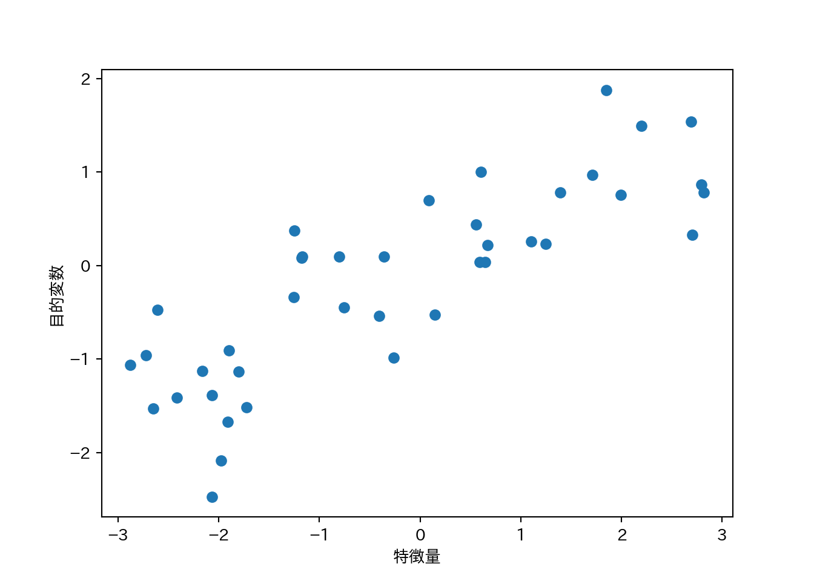<!-- -->

#### 実データ

実データは**scikit-learn**に入ってるものを使う。第1章でも説明したBunchクラスになっている。

- **cancer**: ウィスコンシン乳癌データセット
    - 目的変数は良性(benign)と悪性(malignant)の2値。
    - 特徴量は30。
    - データポイントは569点。


```python
from sklearn.datasets import load_breast_cancer
cancer = load_breast_cancer()
print(cancer.keys())
 ## dict_keys(['target', 'data', 'DESCR', 'target_names', 'feature_names'])
print(cancer.data.shape)
 ## (569, 30)
print(cancer.target_names)
 ## ['malignant' 'benign']
print(np.bincount(cancer.target))
 ## [212 357]
```

- **boston_housing**: 1970年代のボストン近郊の住宅価格。
    - 住宅価格の中央値が目的変数。
    - 特徴量は13。
    - データポイントは506点。


```python
from sklearn.datasets import load_boston
boston = load_boston()
print(boston.data.shape)
 ## (506, 13)
print(boston.feature_names)
 ## ['CRIM' 'ZN' 'INDUS' 'CHAS' 'NOX' 'RM' 'AGE' 'DIS' 'RAD' 'TAX' 'PTRATIO'
 ##  'B' 'LSTAT']
```

- 特徴量同士の積を求めたりして、新しい特徴量を導出することを**特徴量エンジニアリング**と呼ぶ。
- **boston_housing**に対し、重複ありで2つの特徴量の積を求め、データセットの拡張を試みる。
    - 作業が面倒なので既に拡張したものが`mglearn.datasets.load_extended_boston()`で読み込めます。


```python
X, y = mglearn.datasets.load_extended_boston()
print(X.shape)
 ## (506, 104)
```


## アルゴリズム1 $k$-最近傍法

- a.k.a. $k$-NN
- 近いやつは大体おんなじ。

### $k$-最近傍法によるクラス分類

- $k$は参考にする近傍点の個数。
- 1-NNの例。


```python
mglearn.plots.plot_knn_classification(n_neighbors=1)
```

<!-- -->

- 3-NNの例
    - 近傍点が複数のときは多数決で決める。


```python
mglearn.plots.plot_knn_classification(n_neighbors=3)
```

<!-- -->

- **scikit-learn**でやる。


```python
from sklearn.model_selection import train_test_split
X, y = mglearn.datasets.make_forge()
X_train, X_test, y_train, y_test = train_test_split(X, y, random_state=0)
from sklearn.neighbors import KNeighborsClassifier
clf = KNeighborsClassifier(n_neighbors=3).fit(X_train, y_train)
print(clf.score(X_test, y_test))
 ## 0.8571428571428571
```

### KNeighborsClassifierの解析

- 特徴量が2つしかなければ、散布図が描ける。
- 散布図上のあらゆる箇所について**もしその場所に点があったら**と考えて判別ができる。
- つまり、特徴量がつくる平面を分類クラスで塗り分けることができる。
- 境界線を**決定境界**と呼ぶ。


```python
fig, axes = plt.subplots(1, 3, figsize = (10, 3))
for n, ax in zip([1, 3, 9], axes):
    clf = KNeighborsClassifier(n_neighbors = n).fit(X, y)
    mglearn.plots.plot_2d_separator(clf, X, fill=True, eps = 0.5, ax = ax, alpha = .4)
    mglearn.discrete_scatter(X[:, 0], X[:, 1], y, ax = ax)
    ax.set_title("{} neighbor(s)".format(n))
    ax.set_xlabel("特徴量 0")
    ax.set_ylabel("特徴量 1")
axes[0].legend(loc=3)
```

<!-- -->

- 近傍点が多いほど境界がなめらか = モデルは単純になる。
    - 近傍点1 = 最も複雑なモデル
    - 近傍点数 = データ数 -> ただの多数決
- ということは近傍点数の数を増やしていくと、どこかで汎化能力のピークが…？
- **cancer**データセットで試してみる。


```python
from sklearn.datasets import load_breast_cancer
cancer = load_breast_cancer()
X_train, X_test, y_train, y_test = train_test_split(
  cancer.data, cancer.target, stratify = cancer.target, random_state = 66
)
training_accuracy = []
test_accuracy = []
n_settings = range(1, 11)
for n in n_settings:
  clf = KNeighborsClassifier(n_neighbors = n).fit(X_train, y_train)
  training_accuracy.append(clf.score(X_train, y_train))
  test_accuracy.append(clf.score(X_test, y_test))
plt.plot(n_settings, training_accuracy, label = "訓練セット精度")
plt.plot(n_settings, test_accuracy, label = "テストセット精度")
plt.ylabel("精度")
plt.xlabel("近傍点数")
plt.legend()
```

<!-- -->

### $k$-近傍回帰

- kNNは回帰もできる。
- 1-NNでは近傍点の値が新しい観測値に対応する値だと考える。


```python
mglearn.plots.plot_knn_regression(n_neighbors = 1)
```

<!-- -->

  
- 近傍点が複数の時は平均値を使う。


```python
mglearn.plots.plot_knn_regression(n_neighbors = 3)
```

<!-- -->

- **scikit-learn**では、**KNeighborsRegressor**クラスに実装されてる。


```python
from sklearn.neighbors import KNeighborsRegressor
X, y = mglearn.datasets.make_wave(n_samples = 40)
X_train, X_test, y_train, y_test = train_test_split(X, y, random_state=0)
reg = KNeighborsRegressor(n_neighbors = 3).fit(X_train, y_train)
print(reg.score(X_test, y_test))
 ## 0.8344172446249604
```

### KNeighborsRegressorの解析

- 1次元のデータセットに対する予測値は、近傍点数$k$に対してどのように変化するか？


```python
# プロット先を3つ作る
fig, axes = plt.subplots(1, 3, figsize = (15, 4))
# -3〜3までの間にデータポイントを1000点作る
line = np.linspace(-3, 3, 1000).reshape(-1, 1)
for n_neighbors, ax in zip([1, 3, 9], axes):
  reg = KNeighborsRegressor(n_neighbors = n_neighbors)
  reg.fit(X_train, y_train)
  ax.plot(line, reg.predict(line))
  ax.plot(X_train, y_train, '^')
  ax.plot(X_test, y_test, 'v')
  ax.set_title(
    "{} 近傍点\n 訓練スコア: {:.2f} テストスコア{:.2f}".format(
      n_neighbors, reg.score(X_train, y_train), reg.score(X_test, y_test)))
  ax.set_xlabel("特徴量")
  ax.set_ylabel("目的変数")
  
axes[0].legend(["モデルによる予測値", "訓練データ", "テストデータ"], loc="best")
```

<!-- -->

- $k=1$の場合は予測値が全ての訓練データを通るので、モデルが不安定になる。
- 近傍点を増やしていくと予測は滑らかになるが、その反面訓練データへの適合度が下がる。

### 利点と欠点とパラメータ

- 利点
    - モデルが理解しやすい。
    - あまり調整しなくても性能が出やすい。
    - モデル構築は高速
- 欠点
    - 訓練セットが大きくなると予測が遅くなる。
        - 実際に使う前には前処理を行うことが重要。
    - 疎なデータセット(特徴量の多くが0である)に対しては十分な性能が出にくい。

上記の理由から、kNNは実際に使われることは少ない。

## アルゴリズム2 線形モデル

### 線形モデルによる回帰

線形モデルによる予測式は...

$$\hat{y} = w[0]\times x[0] + w[1]\times x[1] + ... + w[p]\times x[p] + b$$

- $\hat{y}$は予測値で、$w$と$b$はモデルのパラメータ。$x$はある一つのデータポイントの特徴量。
- 予測値は、データポイントを適当に重み付けしたもの、と見ることもできる。

**wave**に線形回帰を適用してプロットしてみよう。


```python
mglearn.plots.plot_linear_regression_wave()
 ## w[0]: 0.393906  b: -0.031804
```

<!-- -->

線形モデルを利用した回帰にはいろいろなアルゴリズムがあって、それぞれ以下の点で異なっている。

- どのようにパラメータ$w$と$b$を学習するか。
- モデルの複雑さをどのように制御するのか。

### 線形回帰(通常最小二乗法)

- 予測値と真値の**平均二乗誤差** (mean squared error) を最小にするようなパラメータを求める。
- 線形回帰には複雑さを制御するパラメータがない。できない。


```python
from sklearn.model_selection import train_test_split
from sklearn.linear_model import LinearRegression
X, y = mglearn.datasets.make_wave(n_samples = 60)
X_train, X_test, y_train, y_test = train_test_split(X, y, random_state = 42)
lr = LinearRegression().fit(X_train, y_train)
```

- $w$は**係数** (coefficient)と呼ばれ、`coef_`に格納される。
- $b$は**切片** (intercept)と呼ばれ、`intercept_`に格納される。


```python
print(lr.coef_)
 ## [0.39390555]
print(lr.intercept_)
 ## -0.03180434302675973
```

- 訓練データから得られた属性にアンダースコアを付けるのは**scikit-learn**の慣習である。
- `coef_`は特徴量1つに対して1つの値をもつNumPy配列となる。
- 線形回帰の性能は決定係数$R^2$として求められる。


```python
print(lr.score(X_train, y_train))
 ## 0.6700890315075756
print(lr.score(X_test, y_test))
 ## 0.6593368596863701
```

ここで訓練セットとテストセットの$R^2$があんまり違わないのは（予測性能はともかく）過剰適合していないことを示している。通常、特徴量が多いほど過剰適合のリスクが高まる。拡張した**boston_housing**で確認してみよう。


```python
X, y = mglearn.datasets.load_extended_boston()
X_train, X_test, y_train, y_test = train_test_split(X, y, random_state = 0)
lr = LinearRegression().fit(X_train, y_train)
```

$R^2$を訓練セットとテストセットで比較してみよう。


```python
print(lr.score(X_train, y_train))
 ## 0.9523526436864239
print(lr.score(X_test, y_test))
 ## 0.6057754892935757
```

両者に乖離が見られるのは、過剰適合している可能性がある。

モデルの複雑さを制御できれば良いのだが、線形回帰にはそのためのパラメータがない。パラメータを導入する方法として**リッジ回帰**がある。

### リッジ回帰

- 係数が多いからモデルが複雑になる。
- 係数が0＝その係数を考慮しない。
- 係数が小さければモデルは単純になるのでは🤔
    - 極端な話係数が全部ゼロなら入力に関わらず一定の値(平均とか)を出力するモデルになる。
- 係数ベクトルの長さを最小化しよう！→リッジ回帰


```python
from sklearn.linear_model import Ridge
ridge = Ridge().fit(X_train, y_train) # データは拡張Boston housingのまま
print(ridge.score(X_train, y_train))
 ## 0.8860578560395836
print(ridge.score(X_test, y_test))
 ## 0.7527139600306947
```

- 訓練セットへの予測能力が下がったけどテストセットへの予測能力が上がった！
    - モデルを単純にすることで汎化能力が上がっている。
- リッジ回帰におけるモデルの単純さを制御するパラメータ: $\alpha$
    - 大きいほど制約が強い = モデルが単純になる
    - sklearnのデフォルトは1.0
    - 何が良いかはデータ次第で、自動的には調整されない（後で多分チューニング方法が出て来る）。
    

```python
### alphaを10倍にしてみる パラメータはオブジェクト生成時に指定
ridge10 = Ridge(alpha = 10).fit(X_train, y_train)
print(ridge10.score(X_train, y_train))
 ## 0.7883461511233252
print(ridge10.score(X_test, y_test))
### alphaを0.1倍にしてみる パラメータはオブジェクト生成時に指定
 ## 0.6358967327447733
ridge01 = Ridge(alpha = .1).fit(X_train, y_train)
print(ridge01.score(X_train, y_train))
 ## 0.9285782082010734
print(ridge01.score(X_test, y_test))
 ## 0.7717933688844941
```

$\alpha$の大きさと係数の関係をプロットしてみる。$\alpha$が大きいほど係数の絶対値は小さくなるはず…


```python
plt.plot(ridge.coef_, 's', label="Ridge alpha=1")
plt.plot(ridge10.coef_, '^', label="Ridge alpha=10")
plt.plot(ridge01.coef_, 'v', label="Ridge alpha=0.1")
plt.plot(lr.coef_, 'o', label="LinearRegression")
plt.xlabel("係数のインデックス")
plt.ylabel("係数の値")
plt.hlines(0, 0, len(lr.coef_))
plt.ylim(-25, 25)
plt.legend()
```

<!-- -->

- データサイズを増やしていくとスコアはどのように変化するか？
    - **学習曲線** (learning curve): モデルの性能をデータセットサイズとの関係で表したもの。
    - リッジ回帰は正則化の影響で常に線形回帰より訓練データへの適合が低い。
    - テストセットへの適合はデータセットサイズが小さいうちはリッジ回帰の方が優れる。
    - データセットサイズが大きくなると、リッジ回帰と線形回帰の差はなくなる。
        - データセットサイズが大きくなると、(単純なモデルでは)過剰適合することが難しくなる。


```python
mglearn.plots.plot_ridge_n_samples()
plt.xlabel("訓練セットのサイズ")
plt.ylabel("スコア(R²)")
plt.legend(labels=["リッジ 訓練セット", "リッジ テストセット", "線形回帰 訓練セット", "線形回帰 テストセット"])
```

<!-- -->

### Lasso

- Ridgeとは異なる形で係数に制約をかける線形回帰。
    - L1正則化: L1ノルム、つまり係数の絶対値の和に制約をかける。
- **いくつかの係数が完全に0になる場合がある**という点がRidgeと大きく異なる。
    - 係数が完全に0=係数を除外しているということなので、**自動的な変数選択**ともみなせる。
    - 変数が減ればモデルを解釈しやすくなるという利点もある。
    
Lassoを**boston_housing**に適用する。


```python
from sklearn.linear_model import Lasso
lasso = Lasso().fit(X_train, y_train)
print("訓練データスコア: {:.2f}".format(lasso.score(X_train, y_train)))
 ## 訓練データスコア: 0.29
print("テストデータスコア: {:.2f}".format(lasso.score(X_test, y_test)))
 ## テストデータスコア: 0.21
print("選択された特徴量数: {}".format(np.sum(lasso.coef_ != 0)))
 ## 選択された特徴量数: 4
```

- スコアが非常に悪いのは、パラメータを全くチューニングしていないことによる。
- Lassoには複雑さの度合いを制御するパラメータ`alpha`がある。`alpha`のデフォルトは1.0で、小さくするほど複雑なモデルになる。
- `alpha`を手動で減らす際には、合わせて`max_iter`を増やしてやる必要がある。


```python
lasso001 = Lasso(alpha = 0.01, max_iter=100000).fit(X_train, y_train)
print("訓練データスコア: {:.2f}".format(lasso001.score(X_train, y_train)))
 ## 訓練データスコア: 0.90
print("テストデータスコア: {:.2f}".format(lasso001.score(X_test, y_test)))
 ## テストデータスコア: 0.77
print("選択された特徴量数: {}".format(np.sum(lasso001.coef_ != 0)))
 ## 選択された特徴量数: 33
```

- `alpha`を小さくしすぎると過剰適合する。


```python
lasso00001 = Lasso(alpha = 0.0001, max_iter=100000).fit(X_train, y_train)
print("訓練データスコア: {:.2f}".format(lasso00001.score(X_train, y_train)))
 ## 訓練データスコア: 0.95
print("テストデータスコア: {:.2f}".format(lasso00001.score(X_test, y_test)))
 ## テストデータスコア: 0.64
print("選択された特徴量数: {}".format(np.sum(lasso00001.coef_ != 0)))
 ## 選択された特徴量数: 94
```


Ridgeでやったように係数の大きさをプロットしてみよう。


```python
plt.plot(lasso.coef_, 's', label = "Lasso alpha = 1")
plt.plot(lasso001.coef_, '^', label = "Lasso alpha = 0.01")
plt.plot(lasso00001.coef_, 'v', label = "Lasso alpha = 0.0001")
plt.plot(ridge01.coef_, 'o', label = "Ridge alpha = 0.1")
plt.legend(ncol = 2, loc = (0, 1.05))
plt.ylim = (-25, 25)
plt.xlabel("係数のインデックス")
plt.ylabel("係数の大きさ")
```

<!-- -->

- 合わせてプロットしたRidge($\alpha=0.1$)は、Lasso($\alpha=0.01$)と同じくらいの性能であるが、Ridgeでは大きさが小さいながらも係数の値は0にはなっていないものが多いのに対して、Lassoでは大きさが0の係数が目立つ。
- 実際にはまずRidgeを試すと良い。
- 係数がたくさんあって重要なのはそのうちの幾つか少数であると予想されるのであれば、Lassoを試すと良い。
- RidgeとLassoのペナルティを組合せたものとしてElasticNetがある。結果は良好であるが、チューニングすべきパラメータが増えるという欠点がある。

### クラス分類のための線形モデル

線形モデルでクラス分類を行う場合は以下の式を用いる。

$$\hat{y} = w[0]\times x[0] + w[1]\times x[1] + \dots + w[p]\times x[p] + b > 0$$

- 出力$y$が0を超えるかどうかで判別する。
- 出力$y$は特徴量の線形関数であり、2つのクラスを直線や平面、超平面で分割する**決定境界**となる。
- 線形モデルを学習するアルゴリズムは以下の観点から分類される。
    - どのような尺度で訓練データへの適合度を測るか。
    - 正則化を行うか。行うならどのような方法か。
- **ロジスティック回帰**と**線形サポートベクターマシン**は一般的な線形クラスアルゴリズムである。

**LogisticRegression**と**LinearSVC**により**forge**を分類する決定境界を可視化する。


```python
from sklearn.linear_model import LogisticRegression
from sklearn.svm import LinearSVC
X, y = mglearn.datasets.make_forge()
fig, axes = plt.subplots(1, 2, figsize = (10, 3))
for model, ax in zip([LinearSVC(), LogisticRegression()], axes):
  clf = model.fit(X, y)
  mglearn.plots.plot_2d_separator(clf, X, fill = False, eps = 0.5, ax = ax, alpha = 0.7)
  mglearn.discrete_scatter(X[:, 0], X[:, 1], y, ax = ax)
  ax.set_title("{}".format(clf.__class__.__name__))
  ax.set_xlabel("特徴量 0")
  ax.set_ylabel("特徴量 1")
  
axes[0].legend()
```

<!-- -->

- 2つのクラス分類器はいずれも正則化パラメータCを持つ。Cは大きいほど正則化が弱くなる。
- Cがは小さいとデータポイントの多数派に適合しようとするが、大きくすると個々のデータポイントを正確に分類しようとする。


```python
mglearn.plots.plot_linear_svc_regularization()
```

<!-- -->

- 上記の例では、Cを大きくすると誤分類した少数の点に決定境界が大きく影響されていることがわかる。
- 低次元の場合は線形分類は制約が強いように思えるが、次元数が大きくなるとモデルは強力になり、むしろ過剰適合をいかに避けるかがポイントになる。

**cancer**に**LogisticRegression**を適用してみる。


```python
from sklearn.datasets import load_breast_cancer
cancer = load_breast_cancer()
X_train, X_test, y_train, y_test = train_test_split(
  cancer.data, cancer.target, stratify = cancer.target, random_state = 42
)
logreg = LogisticRegression().fit(X_train, y_train)
print("テストセットスコア: {:.3f}".format(logreg.score(X_train, y_train)))
 ## テストセットスコア: 0.953
print("訓練セットスコア: {:.3f}".format(logreg.score(X_test, y_test)))
 ## 訓練セットスコア: 0.958
```

- **訓練セットとテストセットのスコアが近い場合は適合不足を疑う。**

パラメータCを大きくしてモデルの複雑さを上げる。


```python
logreg100 = LogisticRegression(C=100).fit(X_train, y_train)
print("テストセットスコア: {:.3f}".format(logreg100.score(X_train, y_train)))
 ## テストセットスコア: 0.967
print("訓練セットスコア: {:.3f}".format(logreg100.score(X_test, y_test)))
 ## 訓練セットスコア: 0.965
```

精度が上がった。今度は逆にパラメータCを小さくしてみる。


```python
logreg001 = LogisticRegression(C=0.01).fit(X_train, y_train)
print("テストセットスコア: {:.3f}".format(logreg001.score(X_train, y_train)))
 ## テストセットスコア: 0.934
print("訓練セットスコア: {:.3f}".format(logreg001.score(X_test, y_test)))
 ## 訓練セットスコア: 0.930
```

精度が下がった。最後に、3つのパターンについて係数を可視化してみる。


```python
plt.plot(logreg.coef_.T, 'o', label = "C=1")
plt.plot(logreg100.coef_.T, '^', label = "C=100")
plt.plot(logreg001.coef_.T, 'v', label = "C=0.01")
plt.xticks(range(cancer.data.shape[1]), cancer.feature_names, rotation=90)
plt.hlines(0, 0, cancer.data.shape[1])
plt.xlabel("特徴量")
plt.ylabel("係数の大きさ")
plt.legend()
```

<!-- -->

- デフォルトでは**LogisticRegression**はL2正則化を行う。
- `penalty="l1"`の指定でL1正則化に切り替えることができる。より単純なモデルが欲しければこちらを試すと良い。


```python
for C, marker in zip([0.001, 1, 100], ['o', '^', 'v']):
  lr_l1 = LogisticRegression(C = C, penalty = "l1").fit(X_train, y_train)
  print("訓練セットに対する精度(C={:.3f}): {:.2f}".format(C, lr_l1.score(X_train, y_train)))
  print("テストセットに対する精度(C={:.3f}): {:.2f}".format(C, lr_l1.score(X_test, y_test)))
  plt.plot(lr_l1.coef_.T, marker, label = "C={:.3f}".format(C))
 ## 訓練セットに対する精度(C=0.001): 0.91
 ## テストセットに対する精度(C=0.001): 0.92
 ## 訓練セットに対する精度(C=1.000): 0.96
 ## テストセットに対する精度(C=1.000): 0.96
 ## 訓練セットに対する精度(C=100.000): 0.99
 ## テストセットに対する精度(C=100.000): 0.98
plt.xticks(range(cancer.data.shape[1]), cancer.feature_names, rotation = 90)
plt.hlines(0, 0, cancer.data.shape[1])
plt.xlabel("特徴量")
plt.ylabel("係数の大きさ")
plt.legend(loc = 3)
```

<!-- -->

### 線形モデルによる多クラス分類

- 大抵の線形クラス分類は2クラス分類にしか対応しておらず、そのままでは多クラスに拡張することはできない。
    - ロジスティック回帰は例外
- 拡張するための方法として**1対その他(one-vs.-rest)**アプローチがある。
    - **1つのクラスとその他のクラス**という2クラス分類に対してモデルを学習させる。
    - データポイントに対しては全ての2クラス分類を実行する。
    - **一番高いスコアのクラス分類器**の分類結果を予測結果とする。
    - クラスごとに2クラス分類が存在するということなので、クラスごとに以下の式で表す確信度が存在し、確信度が最も大きいクラスがクラスラベルとなる。
    
$$ w[0] \times x[0] + w[1] \times x[1] + \dots + w[p] \times x[p] + b$$

- 多クラスロジスティック回帰と1対多アプローチは多少異なるが、1クラスあたり係数ベクトルと切片ができるという点は共通している。

3クラス分類に対して1対多アプローチを試す。データはガウス分布からサンプリングした2次元データセットとする。


```python
from sklearn.datasets import make_blobs
X, y = make_blobs(random_state = 42)
mglearn.discrete_scatter(X[:, 0], X[:, 1], y)
plt.xlabel("特徴量0")
plt.ylabel("特徴量1")
plt.legend(["クラス0", "クラス1", "クラス2"])
```

<!-- -->

このデータセットで**LinearSVC**を学習させる。


```python
linear_svm = LinearSVC().fit(X, y)
print("係数ベクトルの形状", linear_svm.coef_.shape)
 ## 係数ベクトルの形状 (3, 2)
print("切片ベクトルの形状", linear_svm.intercept_.shape)
 ## 切片ベクトルの形状 (3,)
```

- 係数ベクトルの形状が3行2列ということは、各行に各クラスに対応する2次元の係数ベクトルが格納されているということである。
- 切片ベクトルはクラスの数に対応している。
- 上記2点をまとめると、3つのクラス分類器が得られているということである。

3つのクラス分類器が作る決定境界を可視化する。


```python
mglearn.discrete_scatter(X[:, 0], X[:, 1], y)
line = np.linspace(-15, 15)
for coef, intercept, color in zip(linear_svm.coef_, linear_svm.intercept_, ['b', 'r', 'g']):
  plt.plot(line, -(line * coef[0] + intercept) / coef[1], c = color)
plt.xlabel("特徴量0")
plt.ylabel("特徴量1")
plt.legend(['クラス0', 'クラス1', 'クラス2', 'クラス0の決定境界', 'クラス1の決定境界', 'クラス2の決定境界'],
  loc = (1.01, 0.3))
```

<!-- -->

- 決定境界が作る領域の中には複数のクラスが属する部分(左、右上、右下の三角形領域)と、すべてのクラスが属さない部分(中央の三角)がある。この内部では、**クラス分類式の値が一番大きいクラス**が予測されるクラスとなる。
- 例えば、中央の三角であれば対応する決定境界が最も近いクラスに分類される。

上記のルールに従って、多クラス分類における最終的な決定境界を示す。


```python
mglearn.plots.plot_2d_classification(linear_svm, X, fill = True, alpha = .7)
mglearn.discrete_scatter(X[:, 0], X[:, 1], y)
line = np.linspace(-15, 15)
for coef, intercept, color in zip(linear_svm.coef_, linear_svm.intercept_, ['b', 'r', 'g']):
  plt.plot(line, -(line * coef[0] + intercept) / coef[1], c = color)
plt.legend(["クラス0", "クラス1", "クラス2", "クラス0の決定境界", "クラス1の決定境界", "クラス2の決定境界"],
  loc = (1.01, 0.3))
plt.xlabel("特徴量0")
plt.ylabel("特徴量1")
```

<!-- -->

### 利点、欠点、パラメータ

- 線形モデルの主要なパラメータ
    - 回帰モデル: alpha
        - 大きいと単純なモデル
    - LinearSVCとLogisticRegression: C
        - 小さいと単純なモデル
- alpha、Cは対数スケールで調整する。
- 正則化を行う場合はL1かL2かも重要なポイント。
    - 一部のパラメータが重要と予想される: L1
        - パラメータを限定できるので、モデルを説明しやすくなる。
    - 特にそのようなこだわりがない: L2
- 線形モデルの利点
    - 訓練、予測ともに高速。
    - 大きなデータセットでも疎なデータセットでも上手く動く。
    - 非常に大きなデータセットへの対処は2通りある。
        - LogisticRegressionとRidgeに`solver='sag'`オプションを指定する。
        - SGDClassifierクラスとSGDRegressorクラスの利用を検討する。
- 線形モデルの欠点
    - 予測手法は理解しやすい反面、係数がなぜその値になっているのかは必ずしも自明ではない。
        - 特に係数間に相関がある場合。
        
## アルゴリズム3 ナイーブベイズクラス分類器

- 線形モデルよりさらに高速に訓練ができる。
    - 汎化性能は劣る場合がある。
- scikit-learnに実装されているナイーブベイズクラス分類器は3種。
    - GaussianNB: 任意の連続値データに適用できる。
    - BernoulliNB: 2値データを仮定している。
    - MultinomialNB: カウントデータを仮定している。
        - カウントデータ...文章中の単語の出現回数など、個々の特徴量の値が何かのカウントであるもの。
- BernoulliNBは特徴量毎に非ゼロの場合をカウントする。


```python
import numpy as np
X = np.array([[0, 1, 0, 1],
              [1, 0, 1, 1],
              [0, 0, 0, 1],
              [1, 0, 1, 0]])
y = np.array([0, 1, 0, 1])
counts = {}
for label in np.unique(y):
  counts[label] = X[y == label].sum(axis=0)
print("非ゼロの特徴量のカウント:\n{}".format(counts))
 ## 非ゼロの特徴量のカウント:
 ## {0: array([0, 1, 0, 2]), 1: array([2, 0, 2, 1])}
```

- MultinominalNBはクラスごとの個々の特徴量の平均値を考慮に入れる。
- GaussianNBは平均値に加えて標準偏差も考慮する。
- 予測式の形は線形モデルと同じになるが、`coef_`は$w$とは若干意味が異なる。

### 利点、欠点、パラメータ

- MultinomialNBとBernoulliNBは唯一のパラメータとしてalphaを持つ。
- alphaを大きくするとモデルの複雑さが減るが、alphaを変化させてもアルゴリズムの性能はそれほど変化しない。しかし、場合によっては精度を多少上げることができる。
- GaussianNBは高次元データに対して用いる場合が多い。
- MultinomialNBはBernoulliNBより若干性能が良く、特に非ゼロ特徴量が多数ある場合に強い。

## アルゴリズム4 決定木

- このセクションのためにはgraphvizをインストールしておく必要がある。
    - `pip install graphviz`以外に、別途OSに応じた方法でgraphvizをインストール。
    - ubuntuならば`sudo apt-get install graphviz`。
- 回帰にも分類にも使える。
- Yes/Noで答えられる質問で出来た**木**を構成する。


```python
mglearn.plots.plot_animal_tree()
```

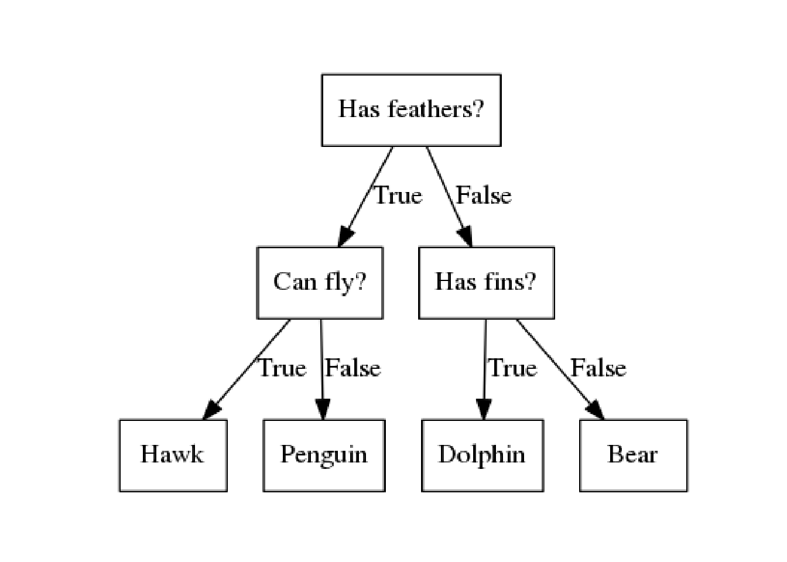<!-- -->


### 決定木の構築

- 2つの特徴量、2つのクラスを持つデータセットtwo_moonを使用する。
    - 2つの特徴量のなす平面上で2つのクラスが半月を組合せたように分布している。


```python
from sklearn.datasets import make_moons
from mglearn.tools import discrete_scatter
X, y = make_moons(n_samples=100, noise=0.25, random_state=3)
plt.figure()
ax = plt.gca()
discrete_scatter(X[:, 0], X[:, 1], y, ax=ax)
ax.set_xticks(())
ax.set_yticks(())
```

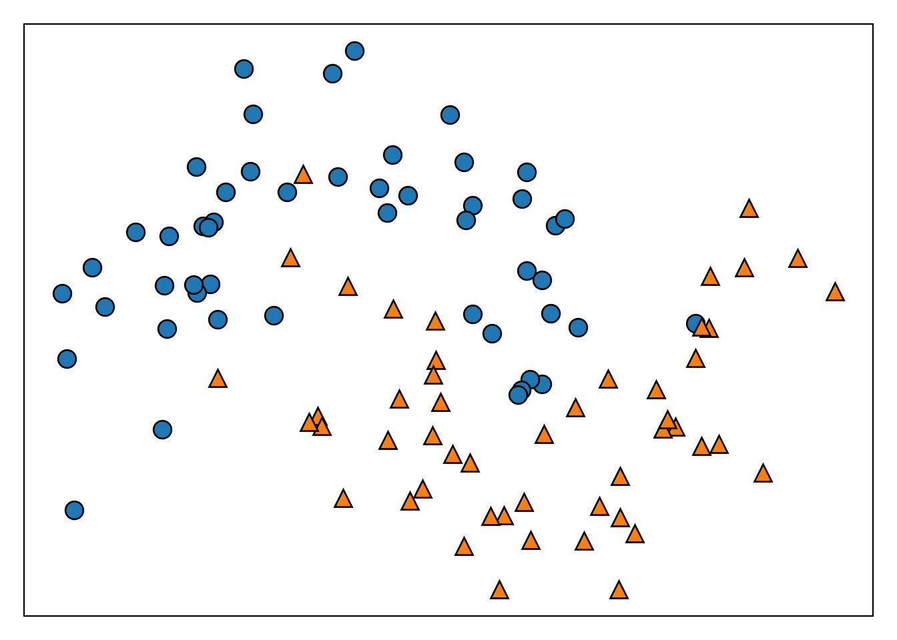<!-- -->

- 木の構築は、データセットの分割の繰り返しである。分割された部分を**葉**と呼ぶ。
- 分割によりテストが1段階増える(e.g. X[1]は0.06以上であるか？)
- 各ステップで分割は情報量が最も多くなるように（最もクラスを分割するように）行われる。
- 分割はテストによってデータセットが完全に分類できるようになるまで進む。
- 1つの葉に1種類のクラスや値しか含まない状態になった木を**純粋**(pure)と呼ぶ。

以下にtwo_moonから純粋な決定木を作成する過程を示す。


```python
for i, max_depth in enumerate([1, 2, 9]):
  fig, ax = plt.subplots(1, 2, figsize = (12, 4), subplot_kw={'xticks': (), 'yticks': ()})
  tree = mglearn.plot_interactive_tree.plot_tree(X, y, max_depth = max_depth, ax = ax[0])
  ax[1].imshow(mglearn.plot_interactive_tree.tree_image(tree))
  plt.show()
  plt.close()
```

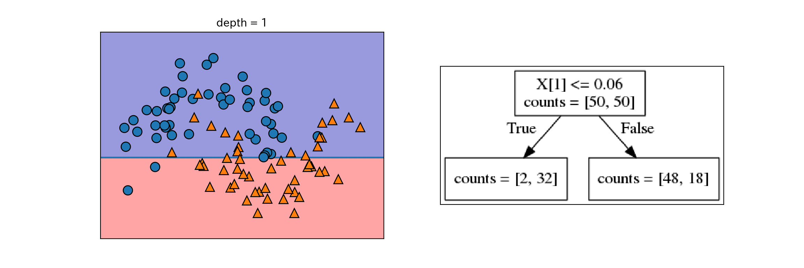<!-- -->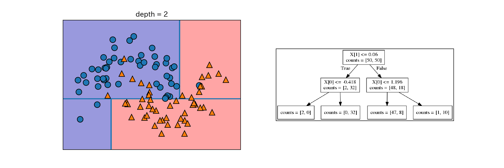<!-- -->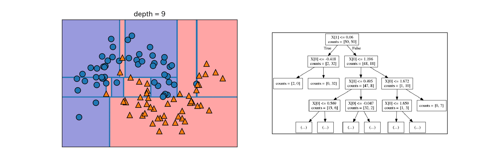<!-- -->

決定木はターゲットがクラスではなく連続値になっても同じように機能するので、回帰にも使える。

### 決定木の複雑さの制御

- 純粋になるまで分割を続けるとルールが複雑になりすぎ、容易に過剰適合してしまう。
- 過剰適合を防ぐ戦略は2つある。
    - 事前枝刈り: 構築過程で木の生成を止める。単に枝刈りとも。
        - 木の深さを制限する方法、葉の最大値を制限する方法、葉に含まれるデータ点の最小数を制限する方法がある。
        - scikit-learnには事前枝刈りしか実装されていない。
    - 事後枝刈り: 木を構築してから情報量の少ない枝を削除する。
- scikit-learnの決定木の実装
    - 回帰: DecisionTreeRegressorクラス
    - 分類: DecisionTreeClassifierクラス

以下ではcancerデータに対して決定木を作成し、枝刈りの効果を確認する。まずはデフォルトの設定で訓練セットに対して木を構築する。デフォルトでは葉が純粋になるまで分類する。


```python
from sklearn.tree import DecisionTreeClassifier
cancer = load_breast_cancer()
X_train, X_test, y_train, y_test = train_test_split(
  cancer.data, cancer.target, stratify=cancer.target, random_state = 42
)
tree = DecisionTreeClassifier(random_state = 0) # 内部でタイブレークの判定に使う乱数を固定している
tree.fit(X_train, y_train)
print("訓練セットに対する精度:{:.3f}".format(tree.score(X_train, y_train)))
 ## 訓練セットに対する精度:1.000
print("テストセットに対する精度:{:.3f}".format(tree.score(X_test, y_test)))
 ## テストセットに対する精度:0.937
```

- 葉が純粋になるまで分割しているので、訓練セットに対する精度は当然1になる。
- テストセットに対する制度は線形モデルの例で見た時より若干低い。

次に、枝刈りの例として木の深さを4に固定してみる。


```python
tree = DecisionTreeClassifier(max_depth = 4, random_state = 0)
tree.fit(X_train, y_train)
print("訓練セットに対する精度:{:.3f}".format(tree.score(X_train, y_train)))
 ## 訓練セットに対する精度:0.988
print("テストセットに対する精度:{:.3f}".format(tree.score(X_test, y_test)))
 ## テストセットに対する精度:0.951
```

訓練セットに対する精度と引き換えに、汎化性能が向上していることが分かる。

### 決定木の解析

- 木の可視化のために、まずは`tree`モジュールの`export_graphviz`関数でグラフを書き出す。
- 出力はグラフに対応するファイル形式である.dot形式のファイル。


```python
from sklearn.tree import export_graphviz
export_graphviz(
  tree, out_file = "output/tree.dot", class_names = ["malignant", "benign"],
  feature_names = cancer.feature_names, impurity = False, filled = True
  )
```

- .dotファイルの可視化はgraphvizモジュールで行う


```python
import graphviz
from PIL import Image
with open("output/tree.dot") as f:
  dot_graph = f.read()
g = graphviz.Source(dot_graph)
g.format = "png"
g.render("output/tree.gv")
img = np.array(Image.open("output/tree.gv.png"))
plt.imshow(img)
plt.axis('off')
```

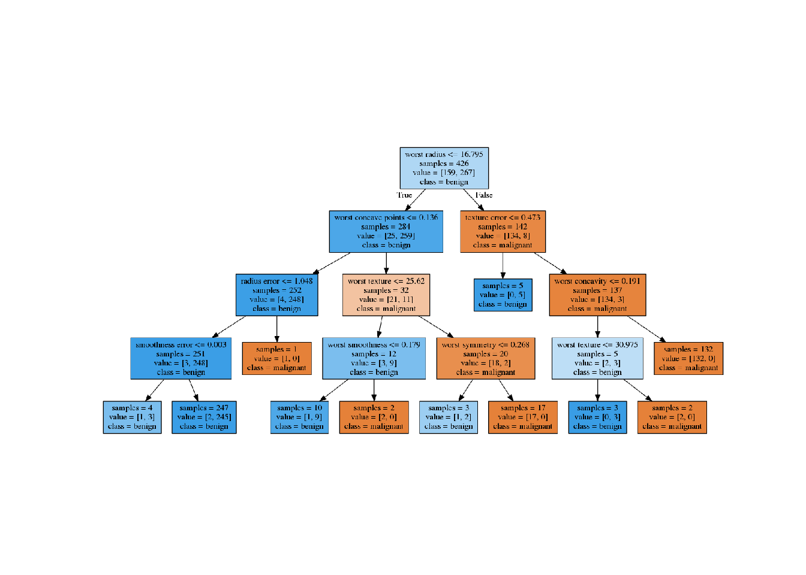<!-- -->

可視化した木は多くの情報を含むが、特に**大部分のデータが通るパスはどこか？**に注目すると良い。

### 決定木の特徴量の重要性

決定木全体を確認し、把握するのは大変な作業なので、以下のような情報が使用される場合がある。

- **特徴量の重要度** (feature importance) 個々の特徴量はそれぞれの判断に対してどの程度重要なのか？
    - 1に近いほど重要。1であればその特徴量だけで完全に判別ができるということ。
    - 0に近いほど重要ではない

特徴量の重要度はフィット済みオブジェクトの`.feature_importance_`に格納されている。    
    

```python
print(tree.feature_importances_)
 ## [0.         0.         0.         0.         0.         0.
 ##  0.         0.         0.         0.         0.01019737 0.04839825
 ##  0.         0.         0.0024156  0.         0.         0.
 ##  0.         0.         0.72682851 0.0458159  0.         0.
 ##  0.0141577  0.         0.018188   0.1221132  0.01188548 0.        ]
```

このままではわかりにくいのでプロットしてみる。


```python
n_features = cancer.data.shape[1]
plt.barh(range(n_features), tree.feature_importances_, align = 'center')
plt.yticks(np.arange(n_features), cancer.feature_names)
plt.xlabel("特徴量の重要度")
plt.ylabel("特徴量")
```

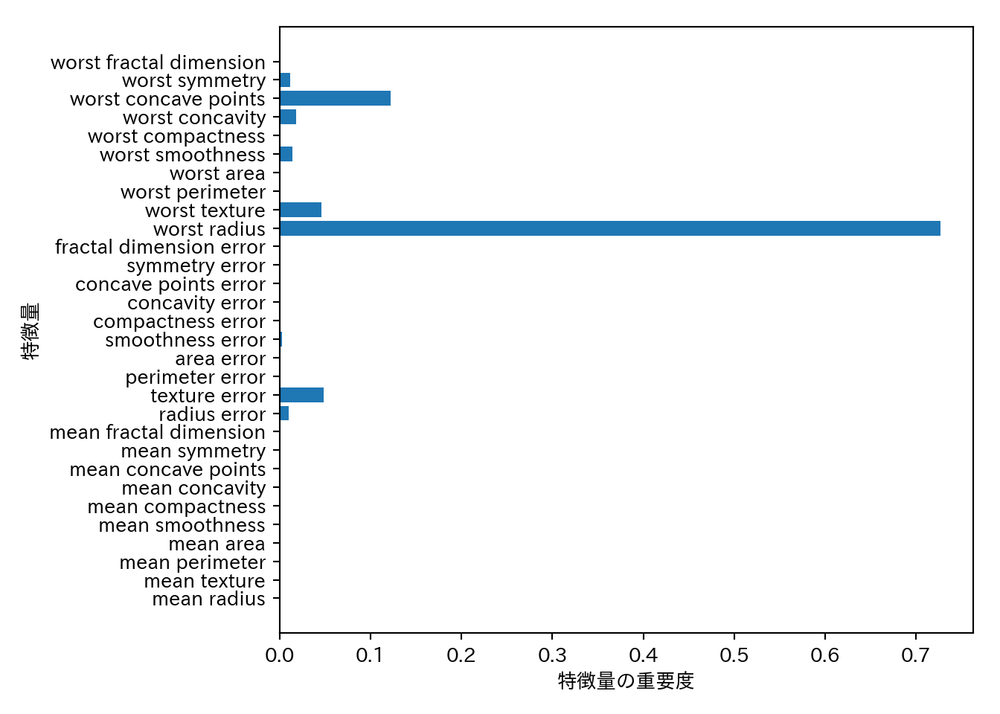<!-- -->

- **特徴量の重要度が高い特徴量**は重要だが、逆は必ずしも成り立たないという点に注意が必要である。
    - 特徴量間に強い相関があり、いずれかの特徴量で十分説明出来てしまう場合は、残りの特徴量がたまたま採用されないということがありうる。
- 特徴量の重要度は係数と異なって常に正であり、その特徴量が大きいとクラスがどれになるのかは直接は分からない。
- 上記の例ではworst radiusは少なくとも重要だが、他に重要な特徴量がある可能性は除外できないし、worst radiusの値と良性・悪性の関係がどのようになっているのかも自明ではない。

そもそも、特徴量とクラスの関係は必ずしも単純とは限らない。例えば次のような2つの特徴量からなる2クラス分類問題を考えてみる。この例は、クラスを分けるルールは単純で明確だが、クラス1はクラス0の中に分布しているので、一定の大小関係だけでは分類できない。


```python
tree = mglearn.plots.plot_tree_not_monotone()
 ## Feature importances: [0. 1.]
```

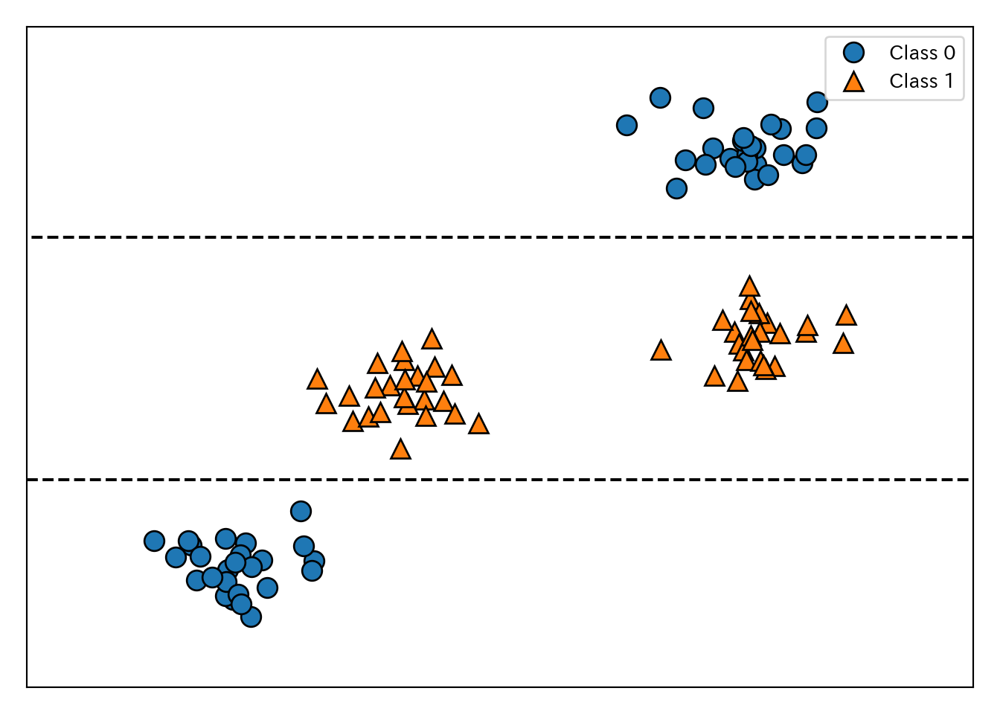<!-- -->


```python
tree.format = "png"
tree.render("output/not_monotone.gv")
img = np.array(Image.open("output/not_monotone.gv.png"))
plt.imshow(img)
plt.axis('off')
```

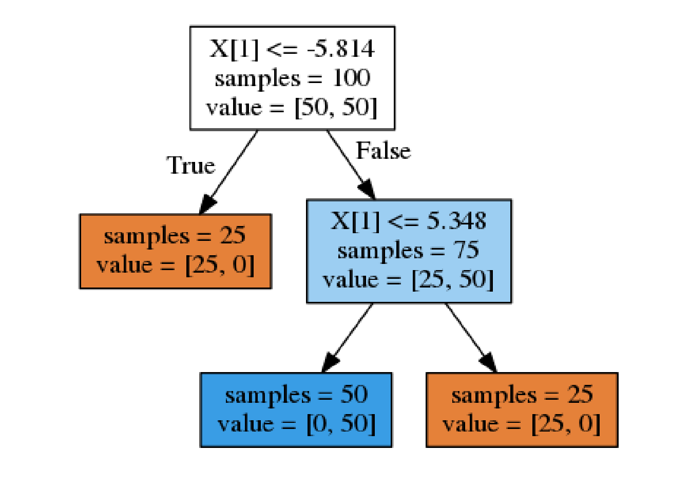<!-- -->

- 決定木による分類の議論は決定木による回帰にも当てはまる。
- 決定木による回帰では、**外挿** (extrapolate)ができない点に注意する。

決定木は外挿ができないという点について、RAM価格の推移データセットを使って例を示そう。


```python
import os
ram_prices = pd.read_csv(os.path.join(mglearn.datasets.DATA_PATH, "ram_price.csv"))
plt.semilogy(ram_prices.date, ram_prices.price)
plt.xlabel("年")
plt.ylabel("1Mバイトあたりの価格($)")
```

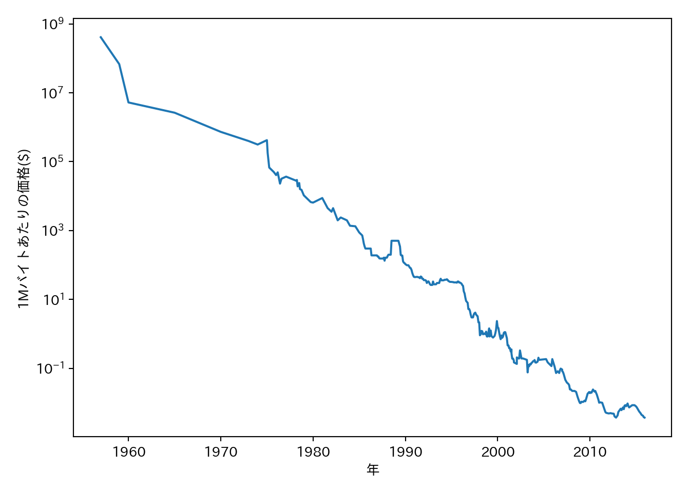<!-- -->

関係を直線的にするために、価格を対数変換しているという点に注意してもらいたい。この種の変換は線形回帰を行う際に重要となる。

データセットに対し、線形回帰と回帰木を適用する。ここでは、2000年より前のデータを訓練セットとし、2000年以降のデータをテストセットとする。つまり、過去のデータから将来を予測する。


```python
from sklearn.tree import DecisionTreeRegressor
data_train = ram_prices[ram_prices.date < 2000]
data_test = ram_prices[ram_prices.date >= 2000]
X_train = data_train.date[:, np.newaxis]
y_train = np.log(data_train.price) #対数変換
# モデルに訓練データをフィットさせる
tree = DecisionTreeRegressor().fit(X_train, y_train)
linear_reg = LinearRegression().fit(X_train, y_train)
# 2000年以降も含めた全てのデータポイントに対して予測を行う
X_all = ram_prices.date[:, np.newaxis]
pred_tree = tree.predict(X_all)
pred_lr = linear_reg.predict(X_all)
price_tree = np.exp(pred_tree) #対数変換を解除
price_lr = np.exp(pred_lr)
## プロット
plt.semilogy(data_train.date, data_train.price, label = "訓練データ")
plt.semilogy(data_test.date, data_test.price, label = "テストデータ")
plt.semilogy(ram_prices.date, price_tree, label = "回帰木")
plt.semilogy(ram_prices.date, price_lr, label = "線形回帰")
plt.legend()
```


```python
plt.tight_layout()
plt.show()
```

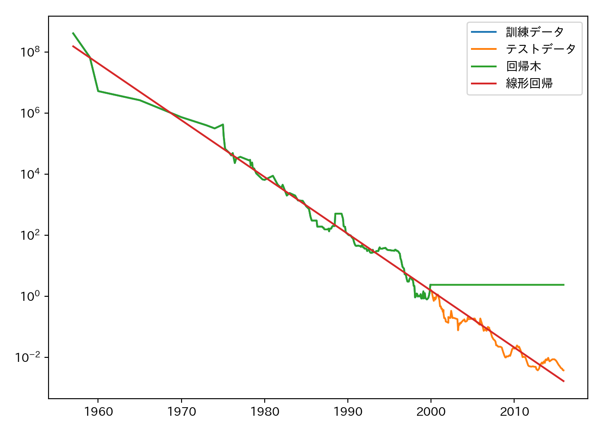<!-- -->

```python
plt.close()
```

線形回帰は2000年以降の値も予測出来ているのに対して、回帰木は単に2000年の値を返すだけになっている。

### 長所、短所、パラメータ

- 決定木のパラメータは事前枝刈りに関するパラメータである。
- 大抵の場合はmax_depth、max_leaf_nodes、min_samples_leafのいずれか1つの指定で十分である。
- 決定木は容易に可視化可能であり、理解しやすい。
- 決定木の分割は特徴量毎に行われるため、特徴量を正規化したり標準化したりする必要はない。
- 特徴量の最大の欠点は事前枝刈りを行ったとしても過剰適合しやすく、汎化性能が低くなりやすいという点である。
