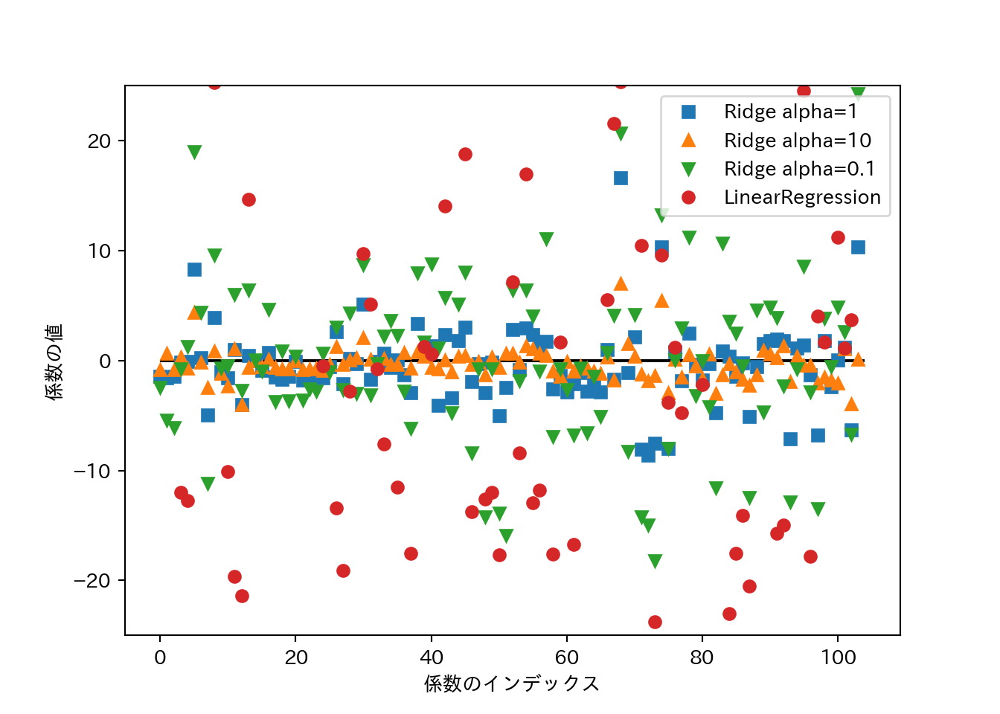

# 教師あり学習

備えます。


```python
import numpy as np
import scipy as sp
import pandas as pd
import matplotlib.pyplot as plt
import matplotlib
matplotlib.rc('font', family='IPAexGothic') # 日本語プロット設定
import mglearn
```

## クラス分類と回帰

教師あり学習はさらに2つに分けられる。

- **クラス分類**: クラスラベルを予測する問題。
    - 2クラス分類 (binary classification): Yes/Noみたいな2択。
        - 片方を**陽性** (positive)、もう片方を**陰性** (negative)とする場合がしばしばある。
    - 他クラス分類 (multiclass classification): もっと選択肢多いやつ。
- **回帰**: 連続値を予測する問題。

2つを区別するのは**出力**が連続かどうか。**入力**はどちらの問題でも連続の場合も離散的な場合もある。

## 汎化、過剰適合、適合不足

- **汎化能力**: 未知のデータ(訓練に使ってないデータ)に対する正しい値を予測する能力。
- **過剰適合**: 訓練データはめっちゃ正確に予測できるけど新しいデータはてんでダメという状態。
- **適合不足**: 訓練データすらちゃんと予測できてないという状態。

一般的には**モデルを複雑にする**ほど訓練データに適合していく。適合不足でなく、過剰適合にならない適度なモデルの複雑さの時に汎化能力が最大になる。そこを目指そう。

### モデルの複雑さとデータセットの大きさ

- モデルが複雑でも、データセットが大きければ過剰適合を避けられる。
- 適度な複雑さのモデルと十分に大きなデータセットを使うことが成功のポイント。

## 教師あり機械学習アルゴリズム

### サンプルデータセット

- **人工的な単純なデータセット**と、**実世界の割と複雑なデータセット**を使う。

#### 人工的な単純なデータセット

単純なデータセットは**mglearn**で生成する。

- **forge**: `mglearn.datasets.make_forge()`で生成する2クラス分類向けデータ。
    - 2つの特徴量と1つの2値目的変数をもつ。


```python
X, y = mglearn.datasets.make_forge()
mglearn.discrete_scatter(X[:, 0], X[:, 1], y)
plt.legend(["Class 0", "Class 1"], loc = 4) # 凡例
plt.xlabel("第1特徴量")
plt.ylabel("第2特徴量")
plt.show()
```


```python
plt.close()
```

- **wave**: `mglearn.datasets.make_wave`で生成する回帰向けデータ。
    - 1つの特徴量と1つの目的変数を持つ。


```python
X, y = mglearn.datasets.make_wave(n_samples = 40)
plt.plot(X, y, 'o')
plt.xlabel("特徴量")
plt.xlabel("目的変数")
plt.show()
```


```python
plt.close()
```

#### 実データ

実データは**scikit-learn**に入ってるものを使う。第1章でも説明したBunchクラスになっている。

- **cancer**: ウィスコンシン乳癌データセット
    - 目的変数は良性(benign)と悪性(malignant)の2値。
    - 特徴量は30。
    - データポイントは569点。


```python
from sklearn.datasets import load_breast_cancer
cancer = load_breast_cancer()
print(cancer.keys())
## dict_keys(['data', 'target', 'target_names', 'DESCR', 'feature_names'])
print(cancer.data.shape)
## (569, 30)
print(cancer.target_names)
## ['malignant' 'benign']
print(np.bincount(cancer.target))
## [212 357]
```

- **boston_housing**: 1970年代のボストン近郊の住宅価格。
    - 住宅価格の中央値が目的変数。
    - 特徴量は13。
    - データポイントは506点。


```python
from sklearn.datasets import load_boston
boston = load_boston()
print(boston.data.shape)
## (506, 13)
print(boston.feature_names)
## ['CRIM' 'ZN' 'INDUS' 'CHAS' 'NOX' 'RM' 'AGE' 'DIS' 'RAD' 'TAX' 'PTRATIO'
##  'B' 'LSTAT']
```

- 特徴量同士の積を求めたりして、新しい特徴量を導出することを**特徴量エンジニアリング**と呼ぶ。
- **boston_housing**に対し、重複ありで2つの特徴量の積を求め、データセットの拡張を試みる。
    - 作業が面倒なので既に拡張したものが`mglearn.datasets.load_extended_boston()`で読み込めます。


```python
X, y = mglearn.datasets.load_extended_boston()
print(X.shape)
## (506, 104)
```


### $k$-最近傍法

備えよう。

### 線形モデル

#### 線形モデルによる回帰

線形モデルによる予測式は...

$$\hat{y} = w[0]\times x[0] + w[1]\times x[1] + ... + w[p]\times x[p] + b$$

- $\hat{y}$は予測値で、$w$と$b$はモデルのパラメータ。$x$はある一つのデータポイントの特徴量。
- 予測値は、データポイントを適当に重み付けしたもの、と見ることもできる。

**wave**に線形回帰を適用してプロットしてみよう。


```python
mglearn.plots.plot_linear_regression_wave()
## w[0]: 0.393906  b: -0.031804
## 
## /Users/rito/myenv/lib/python3.6/site-packages/scipy/linalg/basic.py:1226: RuntimeWarning: internal gelsd driver lwork query error, required iwork dimension not returned. This is likely the result of LAPACK bug 0038, fixed in LAPACK 3.2.2 (released July 21, 2010). Falling back to 'gelss' driver.
##   warnings.warn(mesg, RuntimeWarning)
plt.show()
```


線形モデルを利用した回帰にはいろいろなアルゴリズムがあって、それぞれ以下の点で異なっている。

- どのようにパラメータ$w$と$b$を学習するか。
- モデルの複雑さをどのように制御するのか。

#### 線形回帰(通常最小二乗法)

- 予測値と真値の**平均二乗誤差** (mean squared error) を最小にするようなパラメータを求める。
- 線形回帰には複雑さを制御するパラメータがない。できない。


```python
from sklearn.model_selection import train_test_split
from sklearn.linear_model import LinearRegression
X, y = mglearn.datasets.make_wave(n_samples = 60)
X_train, X_test, y_train, y_test = train_test_split(X, y, random_state = 42)
lr = LinearRegression().fit(X_train, y_train)
```

- $w$は**係数** (coefficient)と呼ばれ、`coef_`に格納される。
- $b$は**切片** (intercept)と呼ばれ、`intercept_`に格納される。


```python
print(lr.coef_)
## [0.39390555]
print(lr.intercept_)
## -0.03180434302675976
```

- 訓練データから得られた属性にアンダースコアを付けるのは**scikit-learn**の慣習である。
- `coef_`は特徴量1つに対して1つの値をもつNumPy配列となる。
- 線形回帰の性能は決定係数$R^2$として求められる。


```python
print(lr.score(X_train, y_train))
## 0.6700890315075756
print(lr.score(X_test, y_test))
## 0.65933685968637
```

ここで訓練セットとテストセットの$R^2$があんまり違わないのは（予測性能はともかく）過剰適合していないことを示している。通常、特徴量が多いほど過剰適合のリスクが高まる。拡張した**boston_housing**で確認してみよう。


```python
X, y = mglearn.datasets.load_extended_boston()
X_train, X_test, y_train, y_test = train_test_split(X, y, random_state = 0)
lr = LinearRegression().fit(X_train, y_train)
```

$R^2$を訓練セットとテストセットで比較してみよう。


```python
print(lr.score(X_train, y_train))
## 0.9523526436864234
print(lr.score(X_test, y_test))
## 0.6057754892935417
```

両者に乖離が見られるのは、過剰適合している可能性がある。

モデルの複雑さを制御できれば良いのだが、線形回帰にはそのためのパラメータがない。パラメータを導入する方法として**リッジ回帰**がある。

#### リッジ回帰

- 係数が多いからモデルが複雑になる。
- 係数が0＝その係数を考慮しない。
- 係数が小さければモデルは単純になるのでは🤔
    - 極端な話係数が全部ゼロなら入力に関わらず一定の値(平均とか)を出力するモデルになる。
- 係数ベクトルの長さを最小化しよう！→リッジ回帰


```python
from sklearn.linear_model import Ridge
ridge = Ridge().fit(X_train, y_train) # データは拡張Boston housingのまま
print(ridge.score(X_train, y_train))
## 0.8860578560395833
print(ridge.score(X_test, y_test))
## 0.7527139600306942
```

- 訓練セットへの予測能力が下がったけどテストセットへの予測能力が上がった！
    - モデルを単純にすることで汎化能力が上がっている。
- リッジ回帰におけるモデルの単純さを制御するパラメータ: $\alpha$
    - 大きいほど制約が強い = モデルが単純になる
    - sklearnのデフォルトは1.0
    - 何が良いかはデータ次第で、自動的には調整されない（後で多分チューニング方法が出て来る）。
    

```python
### alphaを10倍にしてみる パラメータはオブジェクト生成時に指定
ridge10 = Ridge(alpha = 10).fit(X_train, y_train)
print(ridge10.score(X_train, y_train))
## 0.7883461511233252
print(ridge10.score(X_test, y_test))
### alphaを0.1倍にしてみる パラメータはオブジェクト生成時に指定
## 0.6358967327447734
ridge01 = Ridge(alpha = .1).fit(X_train, y_train)
print(ridge01.score(X_train, y_train))
## 0.9285782082010738
print(ridge01.score(X_test, y_test))
## 0.7717933688844855
```

$\alpha$の大きさと係数の関係をプロットしてみる。$\alpha$が大きいほど係数の絶対値は小さくなるはず…

TODO:ラベル位置の調整方法を調べる


```python
plt.plot(ridge.coef_, 's', label="Ridge alpha=1")
plt.plot(ridge10.coef_, '^', label="Ridge alpha=10")
plt.plot(ridge01.coef_, 'v', label="Ridge alpha=0.1")
plt.plot(lr.coef_, 'o', label="LinearRegression")
plt.xlabel("係数のインデックス")
plt.ylabel("係数の値")
plt.hlines(0, 0, len(lr.coef_))
plt.ylim(-25, 25)
plt.legend()
plt.show()
```


```python
plt.close()
```

- データサイズを増やしていくとスコアはどのように変化するか？
    - **学習曲線** (learning curve)

TODO:凡例ラベルの書き換え方を調べる 


```python
mglearn.plots.plot_ridge_n_samples()
plt.xlabel("訓練セットのサイズ")
plt.ylabel("スコア(R²)")
plt.show()
```



```python
plt.close()
```

