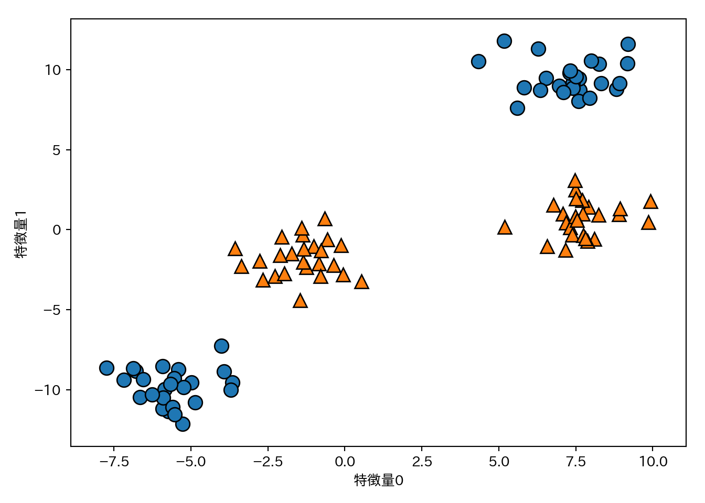
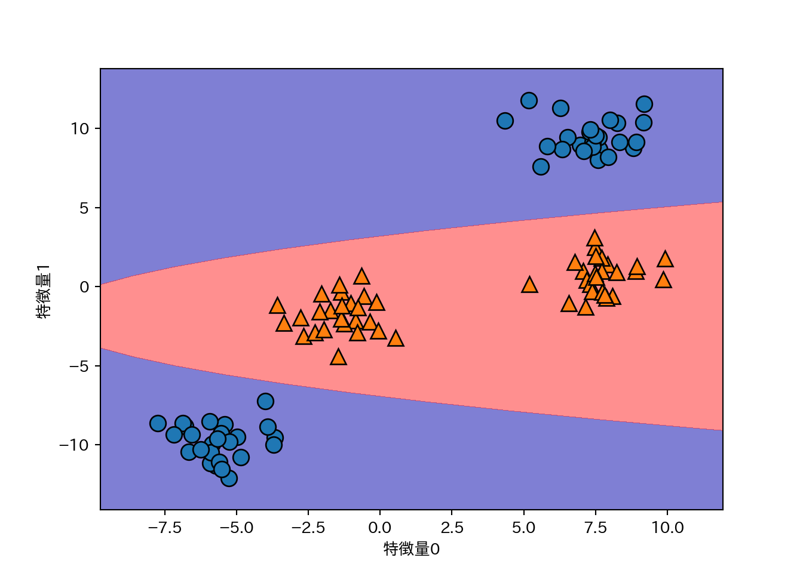
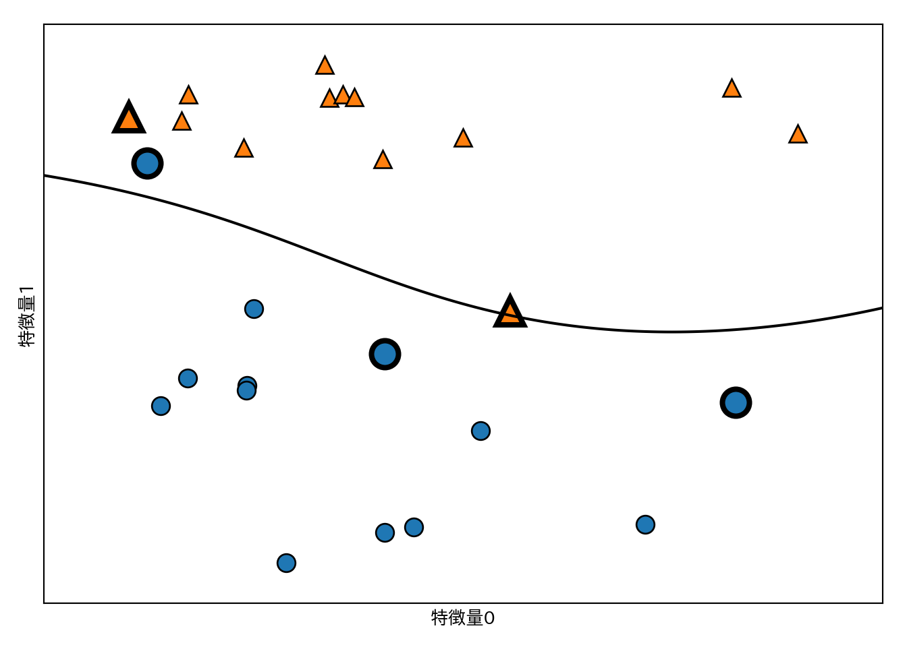
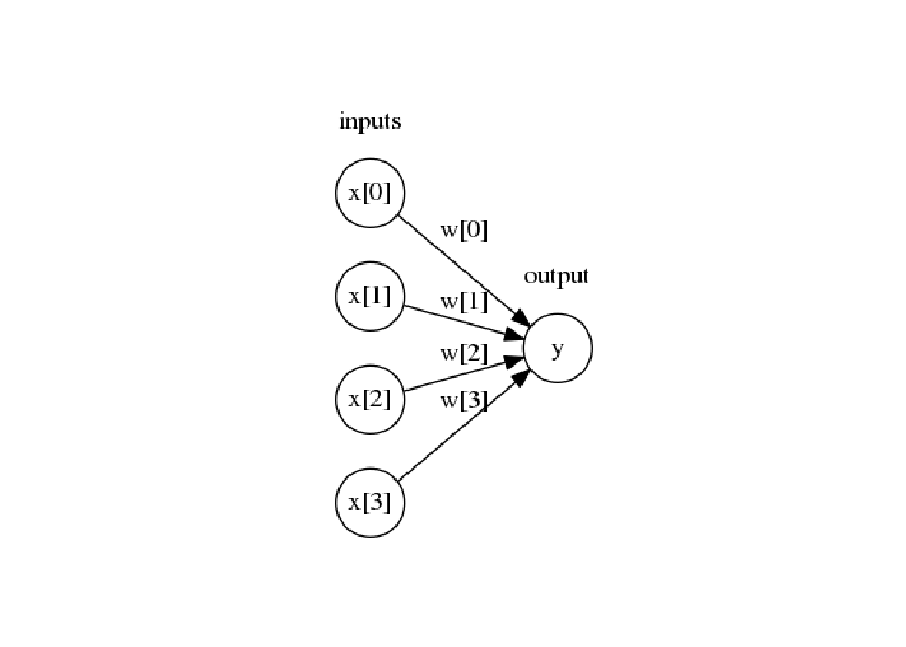

# 教師あり学習 (2)

長くなってきたので章を分けました。


## アルゴリズム5 決定木のアンサンブル法

- アンサンブル法 (Ensembles): 複数の機械学習モデルを組合せてより強力なモデルを構築する手法。
- ランダムフォレストと勾配ブースティングが有名。

### ランダムフォレスト

- 決定木の過剰適合しやすいという欠点に対する対処法の一つ。
- **少しずつ異なる決定木**をたくさん作って、その平均をとるという手法。
    - 木が沢山あるので森

#### ランダムフォレストの構築

- **少しずつ異なる決定木**は次のように作成する。
    - 元のデータセットから**ブートストラップサンプリング**(復元抽出)により新しいデータセット(ブートストラップサンプル)を作成する。
    - 新しいデータセットから決定木を作る。このとき、そのままではブートストラップサンプルから生成される決定木の相関が高くなるので、さらに一工夫することで木の多様性を高める。
      - 分割に使う特徴量を選択する前に、$d$個の特徴量からランダムに$d'$個の特徴量を選ぶ。
          - $d'=\lfloor\sqrt{d}\rfloor$が推奨されているが問題によって調整する必要がある。
          - sklearnでは`max_features=`で指定する。
          - `max_features=`が大きいと木の間の相関が高まり、訓練データに適合しやすくなる。
          - `max_features=`が小さいと木の間の相関は減るが、深いところまで探索しないと訓練データに適合できなくなる。
      - 選択された$d'$個の特徴量から最適な分割を与える特徴量と分割点を定める。
      - 上記の手順を全てのノードで実行する。
- 予測の際は全ての決定木に対して予測する。
    - 回帰のとき: 平均値を予測結果とする。
    - クラス分類のとき: ソフト投票(soft voting: 各木の予測確率の平均値が最大のクラスを予測クラスとする)でクラスを決める。
        - ソフト投票に対するハード投票(hard voting)は、各木に対する予測クラスを先に求め、その多数決で決めるもの。
        
#### ランダムフォレストの解析

**two_moons**データセットにランダムフォレストを適用する。


```python
from sklearn.ensemble import RandomForestClassifier
from sklearn.datasets import make_moons
from sklearn.model_selection import train_test_split
X, y = make_moons(n_samples=100, noise=0.25, random_state=3)
X_train, X_test, y_train, y_test = train_test_split(X, y, stratify=y, random_state=42)
forest = RandomForestClassifier(n_estimators=5, random_state=2)
forest.fit(X_train, y_train)
```

それぞれの決定木は`estimator_`に格納されているので、最終的な予測とともに可視化してみよう。


```python
fig, axes = plt.subplots(2, 3, figsize=(20, 10))
for i, (ax, tree) in enumerate(zip(axes.ravel(), forest.estimators_)):
  ax.set_title("Tree {}".format(i))
  mglearn.plots.plot_tree_partition(X_train, y_train, tree, ax=ax)
  
mglearn.plots.plot_2d_separator(forest, X_train, fill=True, ax=axes[-1, -1], alpha=.4)
axes[-1, -1].set_title("ランダムフォレスト")
mglearn.discrete_scatter(X_train[:, 0], X_train[:, 1], y_train)
```

<!-- -->

もう一つの例としてcancerにランダムフォレストを適用してみよう。今回は木の数は100とする。


```python
from sklearn.datasets import load_breast_cancer
cancer = load_breast_cancer()
X_train, X_test, y_train, y_test = train_test_split(
  cancer.data, cancer.target, random_state=0
)
forest = RandomForestClassifier(n_estimators=100, random_state=0)
forest.fit(X_train, y_train)
print("訓練セットの精度: {:.3f}".format(forest.score(X_train, y_train)))
 ## 訓練セットの精度: 1.000
print("テストセットの精度: {:.3f}".format(forest.score(X_test, y_test)))
 ## テストセットの精度: 0.972
```

ランダムフォレストはチューニングをしなくてもデフォルトのパラメータで十分に高い精度を出すことが多い。

複数の木の平均として求めるため、特徴量の重要度の信頼性も高い。


```python
n_features = cancer.data.shape[1]
plt.barh(range(n_features), forest.feature_importances_, align='center')
plt.yticks(np.arange(n_features), cancer.feature_names)
plt.xlabel("特徴量の重要度")
plt.ylabel("特徴量")
```

<!-- -->

#### 長所、短所、パラメータ

- ランダムフォレストは現在最も広く使われている機械学習手法の一つ。
    - 強力で、チューニングをさほど必要とせず、スケール変換も不要。
- 複数の木を合成する関係上、モデルの解釈は決定木より難しくなる。簡単な解釈が欲しければ決定木を使うのも手。
- 個々の木を作るプロセスは独立なので、並列化も容易にできる。使用コア数は`n_jobs`で指定し、-1を指定すれば全てのコアを使う。
- 高次元で疎なデータに対しては上手く機能しない事が多い。線形モデルを使おう。
- 訓練にも予測にも時間がかかり、メモリも多く使う。速度やメモリが重要な時は線形モデルを使おう。
- `n_estimatros`と`max_features`、`max_depth`などの枝刈りパラメータは検討の余地がある。`n_estimator`は時間とメモリの許す限り大きくすべきだ。
- `max_features`はデフォルトでは以下の設定になっており、大抵の場合はデフォルトでも問題はない。
    - クラス分類: `sqrt(n_features)`
    - 回帰: `n_features`
- `max_features`や`max_leaf_nodes`を設定すると性能が上がったり、訓練と予測の時間が縮まることもある。

### 勾配ブースティング回帰木(勾配ブースティングマシン)

- 1つ前の決定木を次の決定木で修正するように学習が進む。
- デフォルトでは乱数性は無い。
- 深さ1〜5の浅い決定木が使われる。これによりメモリと計算時間を節約できる。
- **弱学習器**(weak learner)を複数組み合わせる。
    - ひとつの学習器は限られた範囲で良い予測を与えるだけだが、組み合わせることで性能を向上させる。
- ランダムフォレストよりパラメータの影響をうけるが、きちんとチューニングをすればランダムフォレストを上回る性能を出せる。
- 重要なパラメータとして**learning_rate**(学習率)がある。これは個々の決定木がどの程度補正を行うのかの強さを決定するパラメータで、大きいほど補正が強い = モデルが複雑になる。

cancerデータで例を見る。


```python
from sklearn.ensemble import GradientBoostingClassifier
X_train, X_test, y_train, y_test = train_test_split(
  cancer.data, cancer.target, random_state=0
)
gbrt = GradientBoostingClassifier(random_state=0)
gbrt.fit(X_train, y_train)
print("訓練セットに対する精度: {:.3f}".format(gbrt.score(X_train, y_train)))
 ## 訓練セットに対する精度: 1.000
print("テストセットに対する精度: {:.3f}".format(gbrt.score(X_test, y_test)))
 ## テストセットに対する精度: 0.958
```

過剰適合が疑われる(訓練セットの精度が高すぎる)ので、モデルを単純にする。


```python
## 枝刈りの深さを浅くする
gbrt = GradientBoostingClassifier(random_state=0, max_depth=1)
gbrt.fit(X_train, y_train)
print("訓練セットに対する精度: {:.3f}".format(gbrt.score(X_train, y_train)))
 ## 訓練セットに対する精度: 0.991
print("テストセットに対する精度: {:.3f}".format(gbrt.score(X_test, y_test)))
 ## テストセットに対する精度: 0.972
```


```python
## 学習率を下げる
gbrt = GradientBoostingClassifier(random_state=0, learning_rate=.01)
gbrt.fit(X_train, y_train)
print("訓練セットに対する精度: {:.3f}".format(gbrt.score(X_train, y_train)))
 ## 訓練セットに対する精度: 0.988
print("テストセットに対する精度: {:.3f}".format(gbrt.score(X_test, y_test)))
 ## テストセットに対する精度: 0.965
```

この例では枝刈りを強くしたほうが汎化性能が上がった。パラメータを可視化してみる。


```python
gbrt = GradientBoostingClassifier(random_state=0, max_depth=1)
gbrt.fit(X_train, y_train)
n_features = cancer.data.shape[1]
plt.barh(range(n_features), gbrt.feature_importances_, align="center")
plt.yticks(np.arange(n_features), cancer.feature_names)
plt.xlabel("特徴量の重要度")
plt.ylabel("特徴量")
```

<!-- -->

- 勾配ブースティングマシンの特徴量の重要度をランダムフォレストと比較すると、いくつかの特徴量が無視されていることがわかる。
- 基本的にはランダムフォレストを先に試したほうが良い。
- 予測時間を短くしたい、チューニングによってギリギリまで性能を高めたいという場合には勾配ブースティングを試す価値がある。
- 勾配ブースティングマシンを大きな問題に試したければ、`xgboost`パッケージの利用を検討したほうが良い。

#### 長所、短所、パラメータ

- 教師あり学習の中で最も強力なモデルの一つ。
- 並列化できないので訓練にかかる時間を短くできない。
- パラメータに影響されやすいので、チューニングを注意深く行う必要がある。
- スケール変換の必要がない、疎なデータには上手く機能しないという点はランダムフォレストと同様。
- 主なパラメータは`n_estimators`と`learning_rate`であるが、ランダムフォレストと異なり`n_estimators`は大きくすれば良いというものではない。大きいほど過学習のリスクが高まる。`n_estimators`をメモリや学習時間との兼ね合いから先に決めておき、`learning_rate`をチューニングするという方法がよくとられる。
- `max_depth`は非常に小さく、5以下に設定される場合が多い。

## アルゴリズム6 カーネル法を用いたサポートベクタマシン

- より複雑なモデルを可能とするため線形モデルを拡張したもの。
- クラス分類にも回帰にも使える(例はクラス分類だけ)。
- 背後にある数学はめっちゃむずい。

### 線形モデルと非線形特徴量

- 線形モデルは特徴量を追加することで柔軟性が増す。
    - 例: 特徴量の交互作用や多項式項を追加する。

過去に扱った、線形分離できない(単純な大小関係だけで判別できない)2クラス分類問題を例に扱う。


```python
from sklearn.datasets import make_blobs
X, y = make_blobs(centers=4, random_state=8)
y = y % 2
mglearn.discrete_scatter(X[:, 0], X[:, 1], y)
plt.xlabel("特徴量0")
plt.ylabel("特徴量1")
```

<!-- -->

このデータは明らかに直線では分離できない。


```python
from sklearn.svm import LinearSVC
linear_svc = LinearSVC().fit(X, y)
mglearn.plots.plot_2d_separator(linear_svc, X)
mglearn.discrete_scatter(X[:, 0], X[:, 1] ,y)
plt.xlabel("特徴量0")
plt.ylabel("特徴量1")
```

<!-- -->

特徴量1の二乗を新たな特徴量として加え、データを3次元にしてみる。


```python
X_new = np.hstack([X, X[:, 1:] ** 2])
from mpl_toolkits.mplot3d import Axes3D, axes3d
figure = plt.figure()
ax = Axes3D(figure, elev=-152, azim=-26)
mask = y == 0
ax.scatter(X_new[mask, 0], X_new[mask, 1], X_new[mask, 2], c='b')
ax.scatter(X_new[~mask, 0], X_new[~mask, 1], X_new[~mask, 2], c='r', marker='^')
ax.set_xlabel("特徴量0")
ax.set_ylabel("特徴量1")
ax.set_zlabel("特徴量1の2乗")
```

<!-- -->

新しく追加した特徴量方向にはクラス0とクラス1が分離可能になっている。


```python
linear_svm_3d = LinearSVC().fit(X_new, y)
coef, intercept = linear_svm_3d.coef_.ravel(), linear_svm_3d.intercept_
figure = plt.figure()
ax = Axes3D(figure, elev=-152, azim=-26)
xx = np.linspace(X_new[:, 0].min() - 2, X_new[:, 0].max() + 2, 50)
yy = np.linspace(X_new[:, 1].min() - 2, X_new[:, 1].max() + 2, 50)
XX, YY = np.meshgrid(xx, yy)
ZZ = (coef[0] * XX + coef[1] * YY + intercept) / -coef[2]
ax.plot_surface(XX, YY, ZZ, rstride=8, cstride=8, alpha=.3)
ax.scatter(X_new[mask, 0], X_new[mask, 1], X_new[mask, 2], c='b')
ax.scatter(X_new[~mask, 0], X_new[~mask, 1], X_new[~mask, 2], c='r', marker='^')
ax.set_xlabel("特徴量0")
ax.set_ylabel("特徴量1")
ax.set_zlabel("特徴量1の2乗")
```

<!-- -->

これを元の空間で見ると、決定境界が直線から曲線になっていることが分かる。


```python
ZZ = YY ** 2
dec = linear_svm_3d.decision_function(np.c_[XX.ravel(), YY.ravel(), ZZ.ravel()])
plt.contourf(XX, YY, dec.reshape(XX.shape), levels=[dec.min(), 0, dec.max()],
             cmap=mglearn.cm2, alpha=.5)
mglearn.discrete_scatter(X[:, 0], X[:, 1], y)
plt.xlabel("特徴量0")
plt.ylabel("特徴量1")
```

<!-- -->

### カーネルトリック

- 上の例では特徴量1の2乗を新しい特徴量として加えることで線形分離可能になったが、通常、**どんな特徴量を追加すれば線形分離可能になるか**は自明ではない。だからといって無闇に特徴量を増やせば計算量が増大してしまう。
- **カーネルトリック**(kernel trick)はこの問題に対応する手法。
- カーネルトリックを使うと実際に特徴量を拡張することなしに、拡張後の空間での特徴量を直接計算できる。この特徴量を直接計算するための関数をカーネルと呼ぶ。例えばガウシアンカーネルと呼ばれるカーネルを使うと、無限次元の空間上で特徴量を計算したのと同じ効果が得られ、しかも計算量はデータ数のみに依存するため、大きくなりすぎる心配がない。
    - テイラー展開すると無限次元への写像になっていることが分かるらしい。
        - cf. [カーネルとは直感的に説明するとなんなのか？ - Qiita](https://qiita.com/keisuke-nakata/items/9d46152ac52dcd2cc92a)
    - ガウシアンカーネルは放射基底関数(radial basis function: RBF)カーネルとも呼ぶ。
- cf. [機械学習におけるカーネル法について - めもめも](http://enakai00.hatenablog.com/entry/2017/10/13/145337)

### SVMを理解する

- SVMは、決定境界の表現にとって個々のデータポイントがどの程度重要かを計算する。
- 基本的には2クラスの境界付近の少数のデータポイントのみが重要となり、これらのデータポイントは**サポートベクタ**と呼ばれる。
- 予測の際は新しいデータポイントとサポートベクタの距離が測定され、これとサポートベクタの重要性を考慮してクラスが決定される。
- ガウシアンカーネルを使用するSVMでは次のガウシアンカーネルを用いて距離を計算する。

$$k_{\mathrm{rbf}}(x_1, x_2) = \exp (- \gamma || x_1-x_2 || ^2) $$

- $x_1$、$x_2$はデータポイントを、$||x_1-x_2||$はユークリッド距離を表し、$\gamma$は制御パラメータである。
    - 注: $\gamma = 1/\sigma^2$として$\sigma$がパラメータとして説明される場合も多い。

SVMによる2クラス分類の結果を示す。


```python
from sklearn.svm import SVC
X, y = mglearn.tools.make_handcrafted_dataset()
svm = SVC(kernel='rbf', C=10, gamma=0.1).fit(X, y)
mglearn.plots.plot_2d_separator(svm, X, eps=.5)
mglearn.discrete_scatter(X[:, 0], X[:, 1], y)
sv = svm.support_vectors_ # サポートベクタをプロット
sv_labels = svm.dual_coef_.ravel() > 0 # クラスラベルのニ値化
mglearn.discrete_scatter(sv[:, 0], sv[:, 1], sv_labels, s=15, markeredgewidth=3)
plt.xlabel("特徴量0")
plt.ylabel("特徴量1")
```

<!-- -->

カーネル法を用いたSVMの決定境界は非線形となる。

### SVMパラメータの調整

- `gamma`: ガウシアンカーネルの幅を調整する。
- `C`: 正則化パラメータ。

パラメータと分類の関係を可視化する。


```python
fig, axes = plt.subplots(3, 3, figsize=(15, 10))
for ax, C in zip(axes, [-1, 0, 3]):
  for a, gamma in zip(ax, range(-1, 2)):
    mglearn.plots.plot_svm(log_C=C, log_gamma=gamma, ax=a)
axes[0, 0].legend(["class 0", "class 1", "sv class 0", "sv class 1"],
                  ncol=4, loc=(.9, 1.2))
```

<!-- -->

- `gamma`は大きいほど個々のデータポイントを重視するようになり、モデルが複雑になる。
- `C`は小さいほどモデルを制限する点は線形モデルと同様。

**cancer**にRBFカーネルを用いたSVMを適用してみよう。


```python
X_train, X_test, y_train, y_test = train_test_split(
  cancer.data, cancer.target, random_state=0
)
svc = SVC().fit(X_train, y_train)
print("訓練セットの精度: {:.3f}".format(svc.score(X_train, y_train)))
 ## 訓練セットの精度: 1.000
print("テストセットの精度: {:.3f}".format(svc.score(X_test, y_test)))
 ## テストセットの精度: 0.629
```

- 訓練セットの精度が1であり、テストセットの精度が低く、過学習している。
- SVMはパラメータとデータのスケールに敏感に反応する。
    - 特にデータのスケールは全ての特徴量で揃っている必要がある。

データのスケールを確認するために、個々の特徴量に対して対数スケールで箱ひげ図を作成する。


```python
plt.boxplot(X_train, sym='+')
plt.ylim(10**-1, 10**4)
plt.xlabel("特徴量のインデックス")
plt.ylabel("特徴量の大きさ")
plt.yscale("log")
```

<!-- -->

### SVMのためのデータの前処理

- **cancer**は前掲のようにデータのスケールが特徴量により著しく異なる。
- 前処理のちゃんとしたやり方は後で説明するので、ここではとりあえず手作業でスケールを揃える。


```python
# 最小値の計算
min_on_training = X_train.min(axis=0)
# レンジ = 最大値 - 最小値を計算
range_on_training = (X_train - min_on_training).max(axis=0)
# 最小値を引いてからレンジで割ることで、min=0、max=1に変換される
X_train_scaled = (X_train - min_on_training) / range_on_training
print("スケール済み特徴量の最小値: {}".format(X_train_scaled.min(axis=0)))
 ## スケール済み特徴量の最小値: [0. 0. 0. 0. 0. 0. 0. 0. 0. 0. 0. 0. 0. 0. 0. 0. 0. 0. 0. 0. 0. 0. 0. 0.
 ##  0. 0. 0. 0. 0. 0.]
print("スケール済み特徴量の最大値: {}".format(X_train_scaled.max(axis=0)))
 ## スケール済み特徴量の最大値: [1. 1. 1. 1. 1. 1. 1. 1. 1. 1. 1. 1. 1. 1. 1. 1. 1. 1. 1. 1. 1. 1. 1. 1.
 ##  1. 1. 1. 1. 1. 1.]
```

テストセットについても同様の変換を行うが、最小値とレンジは訓練セットのものを使う。


```python
X_test_scaled = (X_test - min_on_training) / range_on_training
```

したがって、テストセットのレンジは0〜1ではない。この点については第4章で解説される（らしい）。


```python
print("テストセットの最小値: {}".format(X_test_scaled.min(axis=0)))
 ## テストセットの最小値: [ 0.03540158  0.04190871  0.02895446  0.01497349  0.14260888  0.04999658
 ##   0.          0.          0.07222222  0.00589722  0.00105015 -0.00057494
 ##   0.00067851 -0.0007963   0.05148726  0.01434497  0.          0.
 ##   0.04195752  0.01113138  0.03678406  0.01252665  0.03366702  0.01400904
 ##   0.08531995  0.01833687  0.          0.          0.00749064  0.02367834]
print("テストセットの最大値: {}".format(X_test_scaled.max(axis=0)))
 ## テストセットの最大値: [0.76809125 1.22697095 0.75813696 0.64750795 1.20310633 1.11643038
 ##  0.99906279 0.90606362 0.93232323 0.94903117 0.45573058 0.72623944
 ##  0.48593507 0.31641282 1.36082713 1.2784499  0.36313131 0.77476795
 ##  1.32643996 0.72672498 0.82106012 0.87553305 0.77887345 0.67803775
 ##  0.78603975 0.87843331 0.93450479 1.0024113  0.76384782 0.58743277]
```


スケール済みの特徴量を使ってSVCを行う。


```python
svc = SVC().fit(X_train_scaled, y_train)
print("訓練セットに対する精度: {:.3f}".format(svc.score(X_train_scaled, y_train)))
 ## 訓練セットに対する精度: 0.948
print("テストセットに対する精度: {:.3f}".format(svc.score(X_test_scaled, y_test)))
 ## テストセットに対する精度: 0.951
```

スケール前に比べるとかなりの改善が見られる。さらにパラメータを少し調整すると、さらに良くなる。


```python
svc = SVC(C=1000).fit(X_train_scaled, y_train)
print("訓練セットに対する精度: {:.3f}".format(svc.score(X_train_scaled, y_train)))
 ## 訓練セットに対する精度: 0.988
print("テストセットに対する精度: {:.3f}".format(svc.score(X_test_scaled, y_test)))
 ## テストセットに対する精度: 0.972
```

### 利点、欠点、パラメータ

- いろいろなデータに対して上手く機能する強力なモデルである。
    - データに僅かな特徴量しかなくても決定境界が引ける。
    - 低次元のデータでも高次元のデータでも機能する。
    - サンプルの個数が多いと上手くいかないことがある。
        - 10,000サンプルくらいまではいけるが、100,000サンプルくらいになるとメモリや速度面から厳しくなってくる。
- データの前処理とパラメータのチューニングは必須といえる。
- モデルについて決定木のように誰にでも分かる形で説明するのは難しい。
- パラメータは正則化パラメータ`C`とカーネル固有のパラメータがある。
    - RBFカーネル以外のカーネルを使うこともできる。
    - RBFカーネルにおける`C`と`gamma`は強く相関するため同時いチューニングする必要がある。

## ニューラルネットワーク(ディープラーニング)

- 最近流行りの例のアレ。
- 実際のアルゴリズムの多くは特定の用途向けに注意深く作られたものになっている。
- ディープラーニングの中でも割と簡単な**多層パーセプトロン**(multilayer perceptron: MLP)を例にする。

### ニューラルネットワークモデル

- MLPは線形モデルを一般化して複数ステージで計算するもの。
- 線形回帰は重み付きの和を計算している。


```python
from scipy.misc import imread
ax = plt.gca()
g = mglearn.plots.plot_logistic_regression_graph()
g.format = "png"
g.render("tmp")
ax.imshow(imread("tmp.png"))
plt.axis("off")
plt.show()
```

<!-- -->

```python
plt.close()
```

- MLPは重み付き和の計算を繰り返す。中間ステップを**隠れユニット**と呼ぶ。


```python
ax = plt.gca()
g = mglearn.plots.plot_single_hidden_layer_graph()
g.format = "png"
g.render("tmp")
ax.imshow(imread("tmp.png"))
plt.axis("off")
plt.show()
```

<!-- -->

```python
plt.close()
```

- 重み付き和を単に連続して計算するのは、1つの重み付き和を計算するのと等価なので、もう少し工夫しないと線形モデルと変わらない。
- もう少しの工夫 = 重み付き和の計算結果に**非線形関数**を適用する。
    - relu(rectified linear unit: 正規化線形関数)
        - ゼロ以下の値を切り捨てる。
    - tanh(hyperbolic tangent: 双極正接関数)
        - 小さい値は-1、大きい値は+1に飽和。
    - この工夫によって線形モデルよりはるかに複雑なモデルを学習可能となる。
    
relu関数とtanh関数を示す。relu関数は0との間でmaxを取れば良い。tanh関数はNumPyに実装されている。


```python
line = np.linspace(-3, 3, 100)
plt.plot(line, np.tanh(line), label="tanh")
plt.plot(line, np.maximum(line, 0), label="relu")
plt.legend(loc="best")
plt.xlabel("x")
plt.ylabel("relu(x), tanh(x)")
```

<!-- -->


### ニューラルネットワークのチューニング

**two_moons**データセットを用いる。


```python
from sklearn.neural_network import MLPClassifier
from sklearn.datasets import make_moons
X, y = make_moons(n_samples=100, noise=.25, random_state=3)
X_train, X_test, y_train, y_test = train_test_split(
  X, y, stratify=y, random_state=42
)
mlp = MLPClassifier(solver='lbfgs', random_state=0).fit(X_train, y_train)
mglearn.plots.plot_2d_separator(mlp, X_train, fill=True, alpha=.3)
mglearn.discrete_scatter(X_train[:, 0], X_train[:, 1], y_train)
plt.xlabel("特徴量0")
plt.ylabel("特徴量1")
```

<!-- -->

デフォルトではMLPは100の隠れ層を持ち、これは小さなデータセットに対しては大きすぎるので10に減らしてみる。


```python
mlp = MLPClassifier(solver='lbfgs', random_state=0, hidden_layer_sizes=[10])
mlp.fit(X_train, y_train)
mglearn.plots.plot_2d_separator(mlp, X_train, fill=True, alpha=.3)
mglearn.discrete_scatter(X_train[:, 0], X_train[:, 1], y_train)
plt.xlabel("特徴量0")
plt.ylabel("特徴量1")
```

<!-- -->
